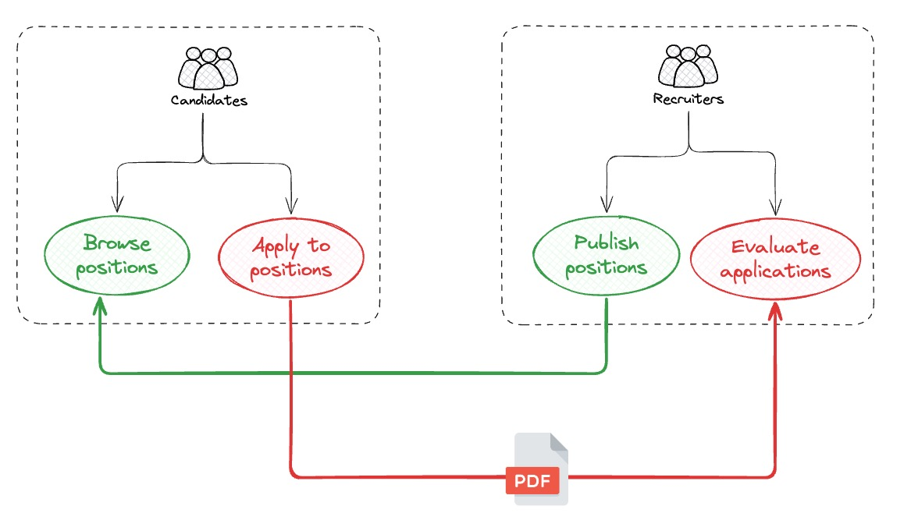
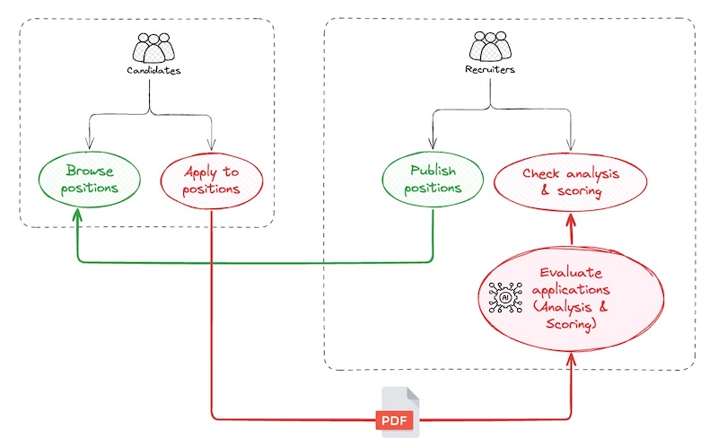
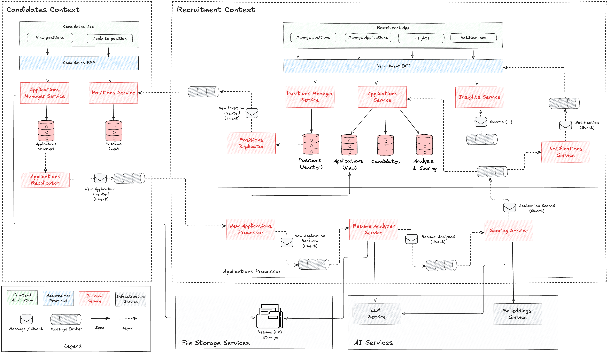
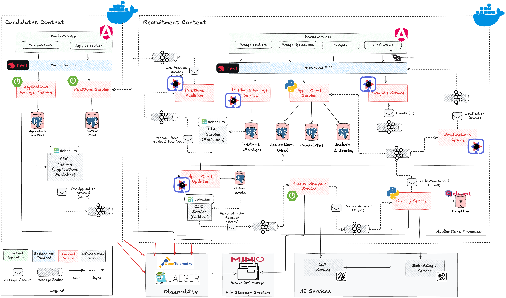

# Casarrubios' Project (Work in Progress "forever")

This repository will serve as a personal portfolio, showcasing various topics in architecture, software development and artificial intelligence through a use case. 

For this reason, the solutions shown in this repository may be more complex than it should be but, as I mentioned, the goal of this repository is to use it as a didactical and playground tool.


**<u>And, also for this reason, this repository is constantly evolving, so solutions shown here could not be completed or can have some errors.</u>**


# How to execute it?

### Requirements

The only software you must have is:

- Docker
- Docker Compose

You don't need to build any service or image. All the necessary images are published as [Github (Public) Packages](https://github.com/jaruizes?tab=packages).


### Execution

In a terminal, execute:

```
cd platform/local
docker-compose up -d 
```

Be patient, it takes some minutes until all the data and services are available and running.

Once everything is up and running, the main URLs are:

| Application                   | URL                                |
| ----------------------------- | ---------------------------------- |
| Recruitment App               | http://localhost:9070/private/home |
| Candidates App                | http://localhost:8081/home         |
| Kafka UI                      | http://localhost:8001/             |
| Jaeger                        | http://localhost:16686/search      |
| Minio (minioadmin/minioadmin) | http://localhost:9001/login        |


# The use case?

The use case implemented in this repository is a recruitment process. The context is a company that publishes positions in its career portal and people interested on these open positions can apply to them and send theirs resumes:




I've participated in many recruitment processes from the recruiter’s side, reading and evaluating a large number of resumes. I know how difficult it is to select the best candidates objectively and without bias. And, obviously, it takes a long time.

**By this reason, the ("revolutionary") idea, applied to this process, consists of performing an scoring algorithm, using artificial intelligence, to get the matching percentage between the candidate and the position applied.**





# Architecture (What? -> How? -> With What?)

In the following sections we are going to desing and define the project architecture starting from the business architecture and ending with the physical architecture.


## Business and Information Architecture (What?)

In this section we are going to define the business (or functional) architecture of the project. 

In the following diagram we can see two different contexts (candidates and recruitment) and the different use cases identified and how they are supported by services:


We also have to define the **information architecture** supporting both contexts:


As we can see in the diagram, there are entities like "Position" and "Application" that exist in both contexts. The idea is to keep both contexts separated in order to be able to evolve them independenly. We have to talk about "masters" and "replicated data" or "projections". Let's see that:

- **Candidates context**:

  - **Position**: represents job offers. it's a projection from the recruitment context. Within the candidate context, positions only are read, never created.

  - **Application**: corresponds to the applications to job offers. Candidates is the owner of this information structure. Applications to positions are created in candidates context and propagated to recruitment context. An application contains a key, a candidate information (name, email, phone) and a CV file. 

    

- **Recruitment context**:

  - **Position**:  represents job offers. Recruitment is the owner. 

    Positions are created  in this context and they are propagated to candidates context. A position contains a key, a title, a description, a list of requirements, a list of responsibilities and a list of benefits. Each requirement contains:

    - key: identify the requirement, for instance "Java", "Python", "Project Management", "Agile"
    - value: set the level of expertise between 1-3 (1=Beginner, 2=Intermediate, 3=Advanced )
    - description: used to give more detail about key and level
    - mandatory: true or false wether the requirement is mandatory or it's opcional

    

    Responsabilities (for instance: "development solutions based on Microservices and Kafka") and Benefits (for instance, "remote work") only contains a description.

    

  - **Application**: it's a projection of "applications" from candidates side. In this case, an application is the set of candidate, position and scoring, meaning that a candidate has applied to a position and an scoring between candidate and position has been calculated 

  - **Candidate**: in this case, I've prefered to extact an independent structure to manage candidates instead of keeping inside the application itself. Keeping separated allows me to analyse them independently of the position applied and being able to include more capabilities in the future like finding the best candidate stored in the system to cover a concrete position

  - **Candidate analysis**: it's the analysis performed from the candidate resume. This structure could evolve in the future, adding more fields to the analysis

  - **Scoring:** represents the percentage of matching between the candidate and the position applied (application). This structure could evolve in the future including more fields related to score.


# Logical Architecture (How?) 

The following picture illustrates the logical architecture of the MVP:




# Physical Architectures (With What?)

In this section I'll expose several alternatives to implement each logical component.




# Some topics implemented

This section is dedicated to explain different concepts, patterns, technology,...,etc associated with the implementation of the project:

- [Testcontainers](doc/testcontainers.md)
- [API Contract First - OpenAPI](doc/api-first-openapi.md)
- [Mutation Testing](doc/mutation-tests.md)
- [Hibernate - Eager/Lazy loading](doc/hibernate-lazy-eager.md)
- [Spring Boot - Exceptions Handler](doc/spring-exceptions-handler.md)
- [Changes in "Modern Angular" (WIP)](doc/angular-changes.md)
- [Typespec (TODO)](doc/typespec.md)
- [Testing in Quarkus (TODO)](doc/testing-quarkus.md)
- K3D/K3S (TODO)
- [CDC using Debezium (TODO)](https://github.com/jaruizes/debezium)
- Spring AI (TODO)
- Quarkus and Langchain (TODO)

