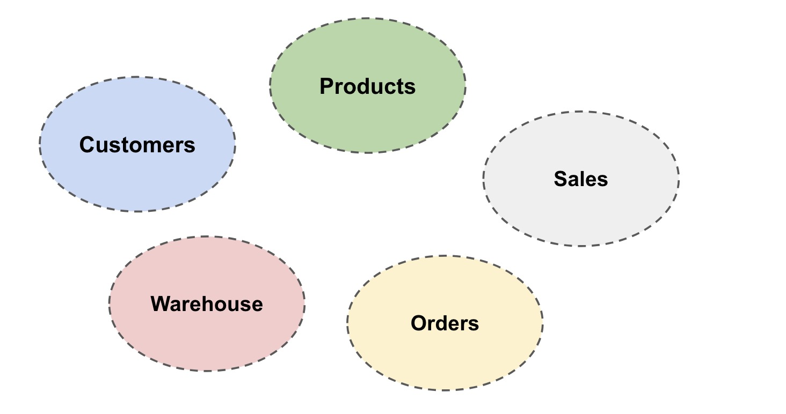
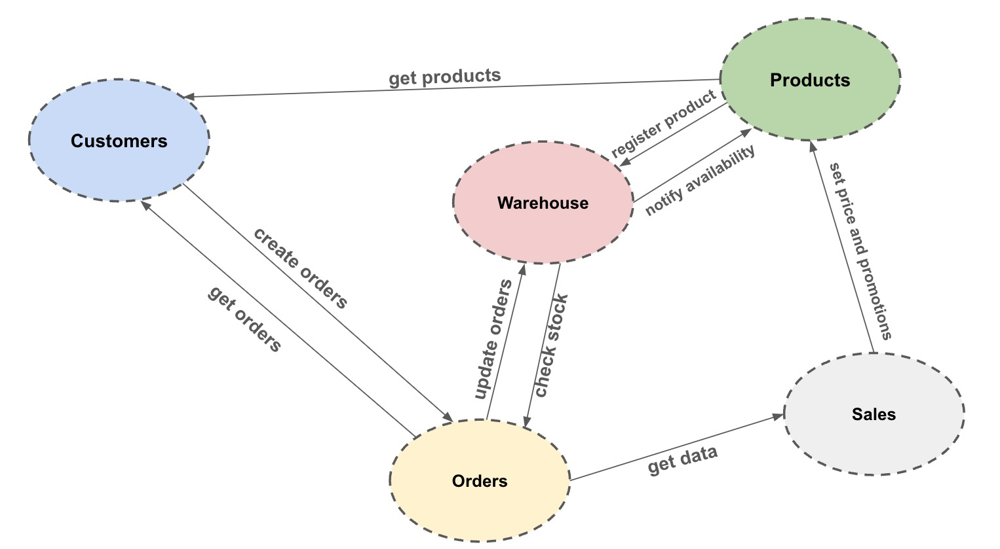

# TOPICS TO COVER

In this repository, I'll try to cover these topics:

- Angular, React, Vue
- Microservices & Microfrontends
- DDD, Contexts
- API: BFF, Management (quotas, throttling, security, testing,...)
- API First: synchronous & asynchronous
- Schema Registry
- Authorization & Authentication, OAuth, OpenID
- Quarkus, Spring, Python, ¿Go?
- Working with legacy systems
- Databases:
  - Postgresql, MySQL
  - Redis
  - Mongo
  - ElasticSearch
  - DuckDB
- EDA: definition, design, infra
- Kafka, KStreams, KSQL, KConnect
- Spark, Flink
- CDC (Debezium,...)
- Gen AI, RAG, LocalAI,...
- K8s & Istio
- Data & Analytics
  - Databricks
  - Snowflake
  - NiFi
  - Airflow
  - Iceberg
  - Apache Superset
- Testcontainers
- Automated testing
- CI/CD
- Kubernetes (check if is possible RH)
- Monitoring & Observability
- Serverless: lambdas & functions, containers (ECS Fargate)
- Platform Engineering, DevEx
- IaC (AWS, Azure, GCP):
  - Terraform
  - CDK

The idea is to use a set of applications and systems working together in order to apply each topic to the use case where it is most relevant and explain the reason for using it. If there are several alternatives, I'll show the pros and cons of each one.

# Business domains

The first step we're going to do is to define business domains. I'm not a subject matter expert in retail or in ecommerce so I've tried to define my own retail. The following picture describes the domains defined:

So, we can see five domains (as I said, I'm not a retail expert). The details about them are:

- **Customers**: this domain is responsible of managing everything related to customer, that is, register process, customer application, notifications, etc...In this domain, I'm going to include a recommendation system in order to offer the best products for each client depending on navigation, needs, etc...
- **Products**: it's responsible of defining products (catalog)
- **Orders**: it manages the order workflow, that means, from an order is created to it is payed and closed. I'm going to include all capabilities relative to payments also in this domain (it could be an independent domain).
- **Sales**: it's responsible of managing prices, promotions and get insights from orders
- **Warehouse**: this domain is responsible of managing stock

Now, we are going to define some relationships between domains. Let's check the following image:

In the image above, we can observe these relationships:

- **Customers <> Products**: Customers domain will retrieve the product catalog from Products domain
- **Products <> Warehouse:** new products are desgined and created in this area so, when a new product is created and registered in the catalog, it's necessary to inform to Warehouse in order to provide stock for that new product. When some stock is provided, Warehouse notifies to Products in order to activate the new product to be sold.
- **Products <> Sales:** Sales is responsible for managing prices and promotions so, this domain will update products prices and set promotions when needed (Black Friday, Christmas, etc...)
- **Customers <> Orders**: Customers will send the new orders to Orders domain and Orders domain will provide the list of orders and their status to Customers domain
- **Orders <> Warehouse**: when an order is requested to created, Orders domain is responsible of creating that order, checking wether stock is available or not and whem the order is created, the order must be updated when there were a change from Warehouse
- **Order <> Sales**: Sales will retrive data about orders for getting insights and making predictions 
