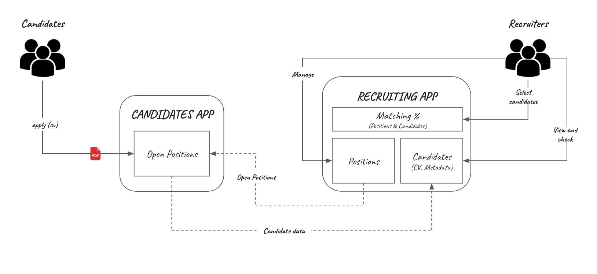
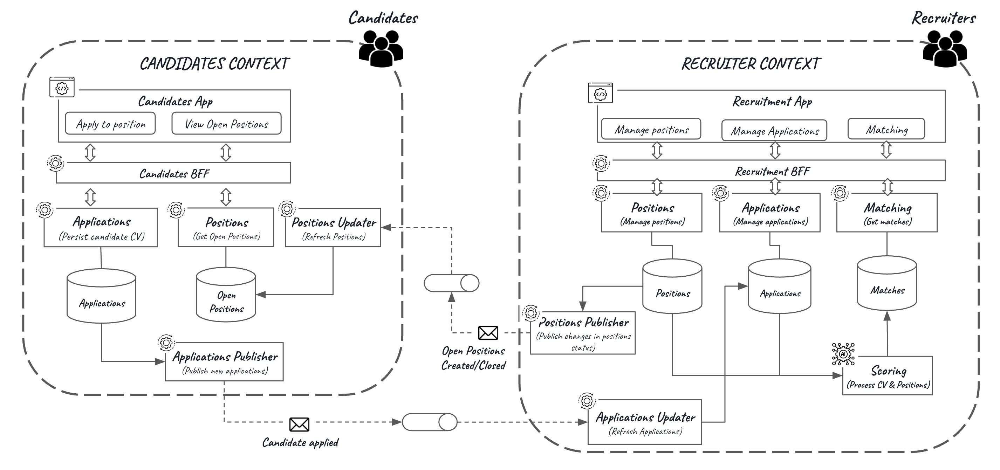
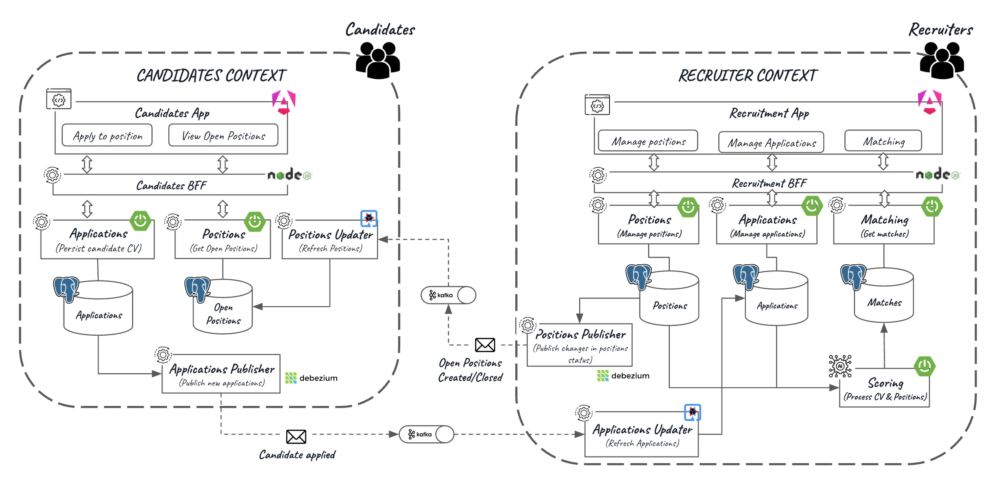

# Casarrubios project (WIP)

This repository will serve as a portfolio, showcasing various topics in architecture, software development, and more through a use case. For this reason, the solutions in this repository may be more complex than it should be but, as I mentioned, the goal of this repository is to use it as a didactical and playground tool.

The aim is to include the most of these topics:

- GenAI and RAG
- Front: Angular, Vue, React
- Backend: Spring Boot, Quarkus, Node
- Authorization, Authentication
- APIs: 
  - Synchronous: Api first, BFF, OpenAPI
  - Asynchronous: Event first, AsyncAPI, Cloud Events
  - Schema Registry
  - Management
- Databases: SQL and NoSQL
- Kafka, Kafka Connect, KStreams
- CDC: Debezium
- Testcontainers
- CI/CD
- Monitoring & Observability: OpenTelemetry, Prometheus, Grafana, Jaeger, ELK

Initially, all the infrastructure will be local, based on Docker and Docker Compose. 

Later on, I'll include Kubernetes (local) and, eventually, cloud infrastructure to cover:

- IaC: Terraform & CDK
- AWS: EKS, Lambda, Fargate, RDS, DMS, Cognito, Bedrock

# Use case (What?)

The use case selected is the recruitment process. We are a company that publishes positions in a portal and people interested on these open positions can apply to them.

The aim is to leverage artificial intelligence to be more efficient during the screening phase and automate the process of selecting the best resumes for each open position. The following picture shows the process:

# Logical Architecture (How?) 

The following picture illustrates the logical architecture of the MVP:

Let's dive into the details. 

We can see two different contexts in order to clearly separate concerns:

- Candidates

  This is the context related to candidates. This context is the owner of applications and a candidate can perform the following actions:

  -  check open positions
  - apply to a position and uploading their resume

  

  This context has the following components or pieces:

  - Frontend

    - Candidates App: this is the contact point for candidates. There are two views or options: view the list of open positions and select one and apply.

    - Candidates BFF: this is the Backend For Frontend associated to the app. By this component, encapsulates all requests to backend (business) services

  - Backend services:

    - Applications: this service implements the logic associated with apply to a position and upload a resume. 
    - Applications publisher: it's in charge of detecting new applications and publishing in order to notify to recruiter context
    - Positions: this service implements the logic associated with get the open positions.
    - Positions Updater: this service updates the open positions database when a new position is published or closed from the recruiter context.

  

  

- Recruiters

  This is the context related to recruiters and the owner of positions. In this context, recruiters can perform the following actions:

  - manage positions: create, open, update, close or delete positions
  - check candidates: view candidates registered in the system (because they are applied to a some position)

  

  This context has the following components or pieces:

  - Frontend

    - Recruitment App: this the contact point for recruiters. There are three views or options: manage positions, view candidates registered and check matches between candidates and positions.

    - Recruitment BFF: this is the Backend For Frontend associated to the app. By this component, encapsulates all requests to backend (business) services

  - Backend services:

    - Positions: it implements the logic associated with positions (create, open, update, close or delete)
    - Positions Publisher: when a position is opened or closed, it's responsible for notifying to candidates context in order to update its position list
    - Applications: this service implements the logic associated with check candidates and resumes. 
    - Applications updater: it's in charge of updating the database associated with candidatos and resumes
    - Scoring: when a new application is received, it's responsible of evaluating it and assigning scores related to the open positions registered
    - Matching: this service implements the logic associated with get the matches saved in the database, associated with candidates and positions.

  

# Physical Architectures (With What?)

In this section I'll expose several alternatives to implement each logical component.

## Alternative 1

(WIP) I'll add more alternatives in the future 

# Some topics implemented

This section is dedicated to explain different concepts, patterns, technology,...,etc associated with the implementation of the project:

- [Testcontainers](doc/testcontainers.md)
- [API Contract First - OpenAPI](doc/api-first-openapi.md)
- [Mutation Testing](doc/mutation-tests.md)
- [Hibernate - Eager/Lazy loading](doc/hibernate-lazy-eager.md)
- [Spring Boot - Exceptions Handler](doc/spring-exceptions-handler.md)
- [Changes in "Modern Angular" (WIP)](doc/angular-changes.md)
- [Typespec (TODO)](doc/typespec.md)
- [Testing in Quarkus (TODO)](doc/testing-quarkus.md)
- K3D/K3S (TODO)
- [CDC using Debezium (TODO)](https://github.com/jaruizes/debezium)
- Spring AI (TODO)
- Quarkus and Langchain (TODO)

