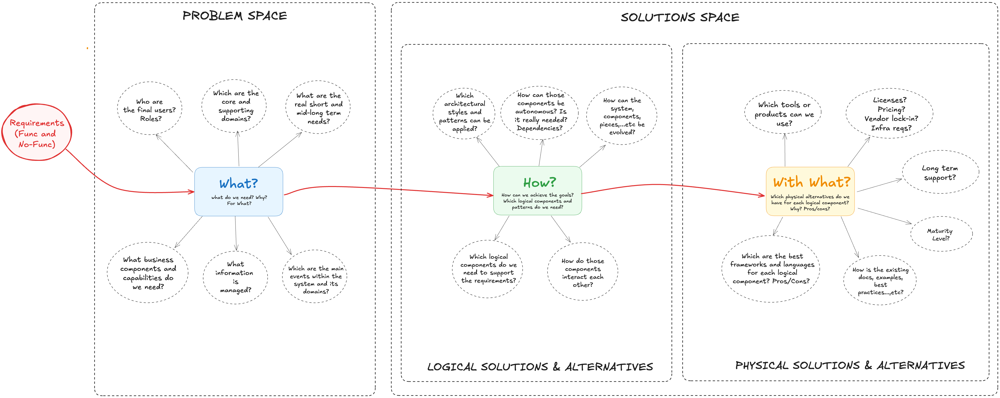
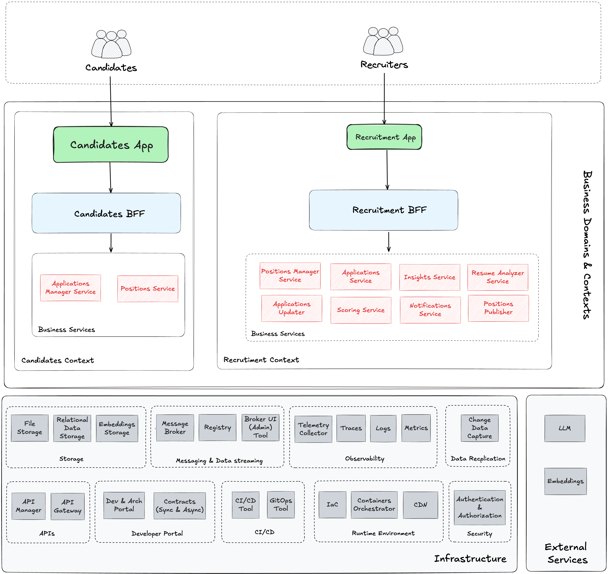

# Casarrubios' Project 

This repository serves as a personal portfolio, showcasing various topics and concepts about architecture, software development, and artificial intelligence through a practical use case. 

For this reason, the solutions shown in this repository may be more complex than they should be in a production environment, but as mentioned, the goal of this repository is to use it as a didactical and playground tool.

:warning: **This repository is constantly evolving, so solutions shown here may not be complete or might contain some errors.**


## Table of Contents

- [Current Status](#current-status)
- [The Business Case](#the-business-case)
- [Project Structure](#project-structure)
- [Requirements](#requirements)
- [How to Execute It](#how-to-execute-it)
- [Candidates and Recruitment Applications](#candidates-and-rRecruitment-aApplications)
- [Architecture](#architecture)
- [CI/CD](#cicd)
- [Additional Topics Covered](#additional-topics-covered)
- 

<br />

<br />

## Current Status

This project is actively being developed as a **portfolio and learning platform**. The current version (MVP) includes:

- ✅ Fully functional Candidates and Recruitment portals developed using Angular
- ✅ AI-powered scoring (embeddings, cosine distance, LLM for explanation) and analysis of resumés (LLM)
- ✅ Business services developed in multiple technologies like Spring, Quarkus or Python
- ✅ EDA and associated technologies like Kafka or Kafka Streams
- ✅ Change Data Capture (CDC) using Debezium for data synchronization between contexts and managing transactions and multiple tables
- ✅ Outbox pattern implementation
- ✅ OpenAPI
- ✅ Traceability using OpenTelemetry and Jaeger
- ✅ Testcontainers fot testing
- ✅ Docker Compose deployment for local execution
- ✅ CI/CD pipeline with GitHub Actions

#### Short-term Goals

- 🔄 Kubernetes deployment (Helm), Infrastructure as Code (IaC) for AWS and GitOps
- 🔄 Include Schema Registry, Avro, AsyncAPI, Event Catalog / Apicurio
- 🔄 Add an API Gateway (Kong for instance) to docker-compose runtime
- 🔄 MCP (Model Context Protocol) and enhance the AI analysis capabilities with more detailed insights
- 🔄 Add an Internal Development Portal (Backstage) 

#### Mid-term Goals

- 📋 Authentication and authorization (Keycloak)

- 📋 Metrics and logs management

- 📋 Develop a candidate recommendation system

- 📋 Add dashboard for recruitment analytics and KPIs

- 📋 Implement configurable scoring algorithms


> **Note:** This roadmap is tentative and subject to change as the project evolves and new learning opportunities are identified.

<br>

## Project Structure

The structure of the project is the following:

- :open_book: ​**doc/** → Documentation
- :rocket: **platform/**
  - **local/** → folders and files associated with docker-compose runtime environment
  - **k8s/** → folders and files associated with Kubernetes runtime environment (in progress)
- :gear: ​**project/**
  - :student: **candidates/** → all the components (frontend, backend, cdc) associated to candidates context
    - frontend →  includes the application and its backend for frontend
    - backend → business services
    - cdc → connectors for change data capture
  - :office_worker: **recruitment/**  → all the components (frontend, backend, cdc) associated to recruitment context
    - frontend →  includes the application and its backend for frontend
    - backend → business services
    - cdc → connectors for change data capture

<br />

## The Business Case

For this project, I've selected a recruitment process as the business case. The scenario involves a company that publishes job positions on its portal where interested candidates can apply and submit their resumes:


Having participated in many recruitment processes from the recruiter's perspective, I understand the challenges of objectively evaluating a large number of resumes without bias. This process is typically time-consuming and labor-intensive.

**The innovative solution implemented in this project uses an AI-powered scoring algorithm to calculate the matching percentage between candidates and the positions they apply for.**


This approach helps streamline the recruitment process by automatically identifying the most suitable candidates based on their qualifications and the job requirements.

<br />


## Requirements


### Self Requirements

In this section, we can find the personal requirements I've set for this project:

- It must apply AI to a real-world case and integrate AI within a complex system.
- It should allow me to apply and learn multiple technologies and patterns across all layers (frontend, backend, data, etc.).
- Infrastructure as Code (IaC) is mandatory.
- Observability is also mandatory.
- It should be deployable in multiple ways and environments: local, cloud (AWS and Azure).
- It should be evolvable, and every piece or component should be interchangeable at any time.


### Functional Requirements

This section outlines the key functional requirements of the system, organized by context.

#### Candidates 

##### Position Browsing and Application

- **View Available Positions**: Candidates must be able to view a list of all available job positions.
- **View Position Details**: Candidates must be able to view detailed information about a specific position, including:
  - Position title and description
  - Required skills and qualifications
  - Responsibilities
  - Benefits offered
- **Apply to Positions**: Candidates must be able to apply to positions by:
  - Submitting personal information (name, email, phone)
  - Uploading a CV/resume (PDF format)
  - Receiving confirmation of successful application submission


#### Recruitment Context

##### Position Management

- **Create Positions**: Recruiters must be able to create new job positions with:
  - Title and description
  - Required skills with proficiency levels (Beginner/Intermediate/Advanced)
  - Responsibilities
  - Benefits
- **Edit Positions**: Recruiters must be able to modify existing positions, updating any field.
- **View Positions**: Recruiters must be able to view all created positions.
- **Candidate View**: Recruiters must be able to preview how a position appears to candidates.


##### Application Management

- **View Applications**: Recruiters must be able to view all applications for a specific position.
- **Application Analysis**: The system must automatically analyze candidate applications, including:
  - Extracting relevant information from resumes
  - Generating a matching score between candidate skills and position requirements
  - Providing a natural language explanation of the score


##### AI-Powered Analysis

- **Candidate Scoring**: The system must calculate a matching percentage between candidates and positions using AI.
- **Detailed Analysis**: For each candidate, the system must provide:
  - Summary of candidate qualifications
  - Strengths relative to the position
  - Potential concerns or gaps
  - Analysis of how well the candidate matches position responsibilities
  - Detailed skill assessment
  - Suggested interview questions

##### Notifications and Insights

- **High-Score Notifications**: Recruiters must receive notifications when candidates score above a certain threshold (e.g., 60%).
- **Recruitment Insights**: The system must provide key metrics and insights about the recruitment process.


#### Cross-Context Requirements

- **Data Synchronization**: Changes in one context must be automatically propagated to the other context:
  - New positions created in the Recruitment context must appear in the Candidates context
  - Applications submitted in the Candidates context must appear in the Recruitment context

For detailed information about the functionality of both applications, please refer to the [functional documentation](doc/core/functional/funtional.md).

<br />


### Technical requirements for working with this project

The technical requirements for working with this project are detailed [here](doc/core/architecture/tech_reqs.md)


<br />


## How to Execute It

### Prerequisites

Before you begin, ensure you have the following installed:

- Docker (latest stable version)
- Docker Compose (latest stable version)
- An OpenAI API Key (required for the AI-powered scoring functionality)

> **Note:** You don't need to build any services or images manually. All necessary images are pre-built and published as [GitHub Public Packages](https://github.com/jaruizes?tab=packages).

### Setup and Execution

1. **Set up your OpenAI API Key**

   Open a terminal and set the environment variable:

   ```shell
   export OPENAI_API_KEY=<your OpenAI API key>
   ```

2. **Start the application**

   In the same terminal, navigate to the local platform directory and start the services:

   ```shell
   cd platform/local
   docker-compose up -d 
   ```

   > **Note:** The initial startup may take several minutes as all services and data are being initialized. Please be patient.

3. **Access the applications**

   Once all services are up and running, you can access the following applications:

   | Application                   | URL                                | Description |
   | ----------------------------- | ---------------------------------- | ----------- |
   | Recruitment App               | http://localhost:9070/private/home | Application for recruiters to manage positions and review applications |
   | Candidates App                | http://localhost:8081/home         | Application for candidates to browse positions and submit applications |
   | Kafka UI                      | http://localhost:8001/             | Interface to monitor Kafka topics and messages |
   | Jaeger                        | http://localhost:16686/search      | Distributed tracing system to monitor and troubleshoot transactions |
   | Minio                         | http://localhost:9001/login        | Object storage service (credentials: minioadmin/minioadmin) |


<br />

### Troubleshooting

If you encounter any issues:

1. Check that all containers are running with `docker ps`
2. View container logs with `docker logs <container_name>`
3. Ensure your OpenAI API key is valid and has sufficient credits


<br />

## Candidates and Recruitment Applications

The project includes **two fully functional applications** that work together to create a complete recruitment ecosystem:

<br />

### Candidates App

**URL:** http://localhost:8081/

This application allows candidates to browse available positions and submit their applications with resumes.


<br />

### Recruitment App

**URL:** http://localhost:9070/

This application enables recruiters to manage job positions, review applications, and see AI-generated scoring and analysis.


For detailed information about the functionality of both applications, please refer to the [functional documentation](doc/core/functional/funtional.md).

<br />

<br />

## Architecture

The project architecture is presented in a layered approach, starting from the business architecture and progressing to the physical implementation.




<br />

### Business and Information Architecture (What?)

This section defines the business (or functional) architecture of the project.

The following diagram illustrates the two distinct contexts (candidates and recruitment), the identified use cases, and how they are supported by various services:


<br />

The **information architecture** supporting both contexts is defined as follows:


<br />

As shown in the diagram, entities like "Position" and "Application" exist in both contexts. The design intentionally keeps these contexts separated to allow them to evolve independently. This approach uses concepts of "master data" and "replicated data" (or "projections"):

- **Candidates Context**:

  - **Position**: Represents job offers. This is a projection from the recruitment context. Within the candidate context, positions are read-only and never created here.

  - **Application**: Corresponds to applications for job positions. The Candidates context is the owner of this information structure. Applications are created in the Candidates context and propagated to the Recruitment context. An application contains a key, candidate information (name, email, phone), and a CV file.

- **Recruitment Context**:

  - **Position**: Represents job offers. The Recruitment context is the owner of this entity.

    Positions are created in this context and propagated to the Candidates context. A position contains:
    - Key: Unique identifier
    - Title: Position name
    - Description: Detailed information about the position
    - Requirements: List of skills and qualifications
    - Responsibilities: List of job duties
    - Benefits: List of perks offered

    Each requirement contains:
    - Key: Identifies the requirement (e.g., "Java", "Python", "Project Management", "Agile")
    - Value: Level of expertise (1=Beginner, 2=Intermediate, 3=Advanced)
    - Description: Additional details about the requirement
    - Mandatory: Boolean indicating whether the requirement is essential or optional

    Responsibilities (e.g., "Develop solutions based on Microservices and Kafka") and Benefits (e.g., "Remote work") only contain descriptions.

  - **Application**: A projection of applications from the Candidates context. In this context, an application represents the relationship between a candidate, a position, and a scoring, indicating that a candidate has applied to a position and received a matching score.

  - **Candidate**: An independent entity extracted from the application data. Keeping candidate information separate allows for analysis independent of the positions applied for and enables future capabilities such as finding the best candidate for a specific position.

  - **Candidate Analysis**: Contains the analysis performed on the candidate's resume. This structure may evolve in the future to include additional analytical fields.

  - **Scoring**: Represents the percentage match between a candidate and the position applied for. This structure may evolve to include more detailed scoring metrics in the future.


<br>

### Logical Architecture (How?) 

I designed this logical architecture showing the main pieces I need to develop and execute the "AI Recruitment System":




> **Note:** From this diagram, several physical approaches or architectures can be built. Not all of them will include all the pieces shown or they will be added in the future. For instance, in the local runtime environment with Docker Compose, components like GitOps Tool or CDN are not included

<br />


Once we have seen all the different components we need, the next step I took was to create a diagram illustrating how the main components will interact with each other.:


<br />

Below is a detailed description of the main components within its respective context:

##### Candidates Context

| Component                    | Description                                                  |
| ---------------------------- | ------------------------------------------------------------ |
| Candidates App               | Frontend application for candidates. It allows candidates to browse available positions and apply to them. |
| Candidates BFF               | Backend for Frontend (BFF) for the Candidates App. It manages interactions between the frontend and backend services. |
| Applications Manager Service | Manages applications submitted by candidates. Provides endpoints to submit applications.<br />Resumés are stored in a File Storage Service |
| Positions Service            | Provides APIs to retrieve positions and their details.       |
| Applications Database        | Stores data related to submitted applications.               |
| Positions Database           | Stores positions data, including requirements, tasks, and benefits.<br />This data is replicated from the Recruitment context. |
| Applications Replicator      | Captures changes in the Applications Database and publishes them to a message broker |

<br>

##### Recruitment Context

| Component                  | Description                                                  |
| -------------------------- | ------------------------------------------------------------ |
| Recruitment App            | Frontend application for recruiters. It allows them to manage positions, view them as candidates would, and review applications with associated scoring and analysis. |
| Recruitment BFF            | Backend for Frontend (BFF) for the Recruitment App. It orchestrates calls between the frontend and backend services. |
| Positions Manager Service  | Provides APIs to create, update, and retrieve positions and their details. |
| Positions Database         | Stores data related to positions, requirements, tasks and benefits |
| Positions Replicator       | Captures changes in the Positions Database (positions, requirements, tasks, benefits) and publishes them to a message broker |
| Applications Service       | Provides APIs to retrieve applications and their associated score and analysis. |
| Applications Database      | Stores data related to applications, candidates, analysis and scoring |
| Insights Service           | Consumes topics like positions and scoring, maintains an internal storage with insights and exposes it via REST API. |
| Notifications Service      | Consumes scoring topics and, when a score exceeds a threshold, publishes a notification to a message broker. These events are consumed by the BFF and pushed to the frontend |
| New Applications Processor | Consumes change data from applications CDC topics, processes them, and updates application tables. Implements the Outbox Pattern to publish “New Application Received” events and triggers the scoring and analysis pipeline. |
| Positions Analyzer Service | Processes “New Application Received” events, retrieves candidate data and resumés, extracts text from resumés, and prompts an LLM to extract insights. Once completed, it publishes a “Resumé Analyzed” event. |
| Scoring Service            | Processes “Resumé Analyzed” events and evaluates candidates against positions using embeddings (cosine similarity). It also prompts an LLM to generate a natural language explanation of the score. |

<br>

<br>

### Physical Architectures (With What?)

In this section I'll expose several alternatives to implement each logical component.


<br>

In the picture above we can see some business components and some infrastructure components supporting them. Let's start with business components:

##### **Candidates Context**

| Logical Component            | Physical Component           | Technology    |
| ---------------------------- | ---------------------------- | ------------- |
| Candidates App               | Candidates App               | Angular       |
| Candidates BFF               | Candidates BFF               | NestJS (Node) |
| Applications Manager Service | Applications Manager Service | Spring Boot   |
| Positions Service            | Positions Service            | Spring Boot   |
| Applications Database        | Applications Database        | PostgreSQL    |
| Positions Database           | Positions Database           | PostgreSQL    |
| Applications Replicator      | Applications Publisher       | Debezium      |

<br>

##### **Recruitment Context**

| Logical Component          | Physical Component         | Technology              |
| -------------------------- | -------------------------- | ----------------------- |
| Recruitment App            | Recruitment App            | Angular                 |
| Recruitment BFF            | Recruitment BFF            | NestJS (Node)           |
| Positions Manager Service  | Positions Manager Service  | Quarkus                 |
| Positions Database         | Positions Database         | PostgreSQL              |
| Positions Replicator       | Positions CDC Service      | Debezium                |
| Positions Replicator       | Positions Publisher        | Quarkus (Kafka Streams) |
| Applications Service       | Applications Service       | Python                  |
| Applications Database      | Applications Database      | PostgreSQL              |
| Insights Service           | Insights Service           | Quarkus (Kafka Streams) |
| Notifications Service      | Notifications Service      | Quarkus                 |
| New Applications Processor | Applications Updater       | Quarkus (Outbox)        |
| New Applications Processor | Outbox CDC Service         | Debezium                |
| New Applications Processor | Outbox table               | PostgreSQL              |
| Positions Analyzer Service | Positions Analyzer Service | Spring Boot             |
| Scoring Service            | Scoring Service            | Python                  |

<br>


Now, let's check **infrastructure components**:

| Component               | Technology     | Description                                                  |
| ----------------------- | -------------- | ------------------------------------------------------------ |
| Streaming Tool          | Kafka          | It allows publishing and consuming messages between components and provides streaming capabilities |
| Change Data Capture     | Debezium       | It detects changes in databases and publishes them to Kafka  |
| Relational Database     | PostgreSQL     | It stores relational information                             |
| File Storage            | Minio          | It used to store resumé files                                |
| LLM                     | Open AI        | It uses to analyse resumés and get score explanations        |
| Embeddings Generator    | Open AI        | It generates embeddings from texts                           |
| Embeddings Database     | Qdrant         | It stores embeddings calculated                              |
| Observability collector | OTEL Collector | It receives, processes and exports telemetry data            |
| Tracing tool            | Jaeger         | It shows traces within executions                            |

<br>

<br>

## CI/CD

The project implements a Continuous Integration and Continuous Deployment (CI/CD) pipeline based on **GitHub Actions**. The pipeline automates the process of building, creating Docker images, and publishing them to **GitHub Packages**:


<br />

This automation ensures consistent builds and deployments, making it easier to maintain and update the project components.

> **Note:** Currently, the MVP is deployed using Docker Compose. Future releases will incorporate Infrastructure as Code (IaC) and deployment to cloud platforms such as AWS and Azure.

<br />

<br />

## Additional Topics Covered

This section explains various concepts, patterns, and technologies implemented in this project. Each topic includes a link to detailed documentation:

#### Testing & Quality Assurance
- [Testcontainers](doc/topics/testcontainers.md) - Integration testing with containerized dependencies
- [Mutation Testing](doc/topics/mutation-tests.md) - Advanced testing technique to evaluate test suite effectiveness

#### API Development
- [API Contract First - OpenAPI](doc/topics/api-first-openapi.md) - Designing APIs before implementation

#### Frameworks & Libraries
- [Hibernate - Eager/Lazy loading](doc/topics/hibernate-lazy-eager.md) - Data loading strategies in Hibernate
- [Spring Boot - Exceptions Handler](doc/topics/spring-exceptions-handler.md) - Centralized exception handling in Spring Boot
- [Angular: Standalone Components vs Modules)](doc/topics/angular-changes.md) - Standalone Components vs Modules in Angular framework

#### Data Integration
- [CDC using Debezium](https://github.com/jaruizes/debezium) - Change Data Capture implementation with Debezium

#### Google Colab & IA

- [Colab "hypothesis" scoring candidates](https://github.com/jaruizes/AI-CVMatcher)


<br />

> 
