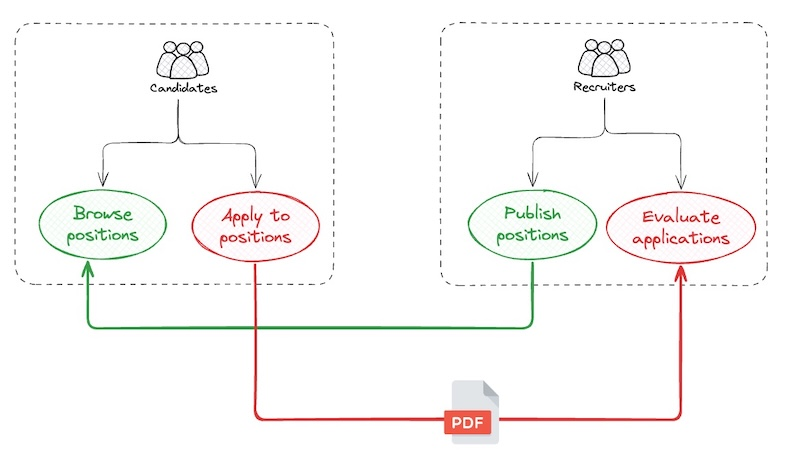

# Casarrubios' Project 

This repository will serve as a personal portfolio, showcasing various topics and concepts about architecture, software development and artificial intelligence through a use case. 

For this reason, the solutions shown in this repository may be more complex than it should be but, as I mentioned, the goal of this repository is to use it as a didactical and playground tool.


:warning: ​ **And, also for this reason, this repository is constantly evolving, so solutions shown here could not be completed or can have some errors.**


<br>

## The "business case"

I've selected a recruitment process for this side project. The context could be a company that publishes job positions in its portal where people interested in these positions can apply and submit their resumes:




I've participated in many recruitment processes from the recruiter’s side, reading and evaluating a large number of resumes. I know how difficult it is to select the best candidates objectively and without bias. And, obviously, it takes a long time.

**By this reason, the ("revolutionary") idea, applied to this process, consists of performing an scoring algorithm, using artificial intelligence, to get the matching percentage between the candidate and the position applied.**


<br>

<br>

## Project Structure

The structure of the project is the following:

- :open_book: ​**doc/** → Documentation
- :rocket: **platform/**
  - **local/** → folders and files associated with docker-compose runtime environment
  - **k8s/** → folders and files associated with Kubernetes runtime environment (in progress)
- :gear: ​**project/**
  - :student: **candidates/** → all the components (frontend, backend, cdc) associated to candidates context
    - frontend →  includes the application and its backend for frontend
    - backend → business services
    - cdc → connectors for change data capture
  - :office_worker: **recruitment/**  → all the components (frontend, backend, cdc) associated to recruitment context
    - frontend →  includes the application and its backend for frontend
    - backend → business services
    - cdc → connectors for change data capture


<br>

<br>

## How to execute it?

#### Requirements

The only requirements are:

- Docker
- Docker Compose
- An OpenAI API Key

(*) You don't need to build any service or image. All the necessary images are published as [Github (Public) Packages](https://github.com/jaruizes?tab=packages).


#### Execution

You need set an environment variable for the OpenAI API Key. Open a Terminal and execute:

```shell
export OPENAI_API_KEY=<your openai key>
```


In the same terminal, execute:

```shell
cd platform/local
docker-compose up -d 
```

Be patient, it takes some minutes until all the data and services are available and running.

Once everything is up and running, the main URLs are:

| Application                   | URL                                |
| ----------------------------- | ---------------------------------- |
| Recruitment App               | http://localhost:9070/private/home |
| Candidates App                | http://localhost:8081/home         |
| Kafka UI                      | http://localhost:8001/             |
| Jaeger                        | http://localhost:16686/search      |
| Minio (minioadmin/minioadmin) | http://localhost:9001/login        |


<br>

<br>

## The "applications"

There are **two fully functional applications**:


- **Candidates**: http://localhost:8081/

  

  

- **Recruitment**: http://localhost:9070/

  


A detailed section about functionality is [here](doc/core/functional/funtional.md)


<br>

<br>

## Architecture

In the following sections we are going to desing and define the project architecture starting from the business architecture and ending with the physical architecture.


### Business and Information Architecture (What?)

In this section we are going to define the business (or functional) architecture of the project. 

In the following diagram we can see two different contexts (candidates and recruitment) and the different use cases identified and how they are supported by services:


<br>

We also have to define the **information architecture** supporting both contexts:


As we can see in the diagram, there are entities like "Position" and "Application" that exist in both contexts. The idea is to keep both contexts separated in order to be able to evolve them independenly. We have to talk about "masters" and "replicated data" or "projections". Let's see that:

- **Candidates context**:

  - **Position**: represents job offers. it's a projection from the recruitment context. Within the candidate context, positions only are read, never created.

  - **Application**: corresponds to the applications to job offers. Candidates is the owner of this information structure. Applications to positions are created in candidates context and propagated to recruitment context. An application contains a key, a candidate information (name, email, phone) and a CV file. 

    

- **Recruitment context**:

  - **Position**:  represents job offers. Recruitment is the owner. 

    Positions are created  in this context and they are propagated to candidates context. A position contains a key, a title, a description, a list of requirements, a list of responsibilities and a list of benefits. Each requirement contains:

    - key: identify the requirement, for instance "Java", "Python", "Project Management", "Agile"
    - value: set the level of expertise between 1-3 (1=Beginner, 2=Intermediate, 3=Advanced )
    - description: used to give more detail about key and level
    - mandatory: true or false wether the requirement is mandatory or it's opcional

    

    Responsabilities (for instance: "development solutions based on Microservices and Kafka") and Benefits (for instance, "remote work") only contains a description.

    

  - **Application**: it's a projection of "applications" from candidates side. In this case, an application is the set of candidate, position and scoring, meaning that a candidate has applied to a position and an scoring between candidate and position has been calculated 

  - **Candidate**: in this case, I've prefered to extact an independent structure to manage candidates instead of keeping inside the application itself. Keeping separated allows me to analyse them independently of the position applied and being able to include more capabilities in the future like finding the best candidate stored in the system to cover a concrete position

  - **Candidate analysis**: it's the analysis performed from the candidate resume. This structure could evolve in the future, adding more fields to the analysis

  - **Scoring:** represents the percentage of matching between the candidate and the position applied (application). This structure could evolve in the future including more fields related to score.


<br>

### Logical Architecture (How?) 

The following picture illustrates the logical architecture of the MVP:


Let's see more detail about each component and its context:

##### 🧑‍💼 Candidates Context

| Component                    | Description                                                  |
| ---------------------------- | ------------------------------------------------------------ |
| Candidates App               | Frontend application for candidates. It allows candidates to browse available positions and apply to them. |
| Candidates BFF               | Backend for Frontend (BFF) for the Candidates App. It manages interactions between the frontend and backend services. |
| Applications Manager Service | Manages applications submitted by candidates. Provides endpoints to submit applications.<br />Resumés are stored in a File Storage Service |
| Positions Service            | Provides APIs to retrieve positions and their details.       |
| Applications Database        | Stores data related to submitted applications.               |
| Positions Database           | Stores positions data, including requirements, tasks, and benefits.<br />This data is replicated from the Recruitment context. |
| Applications Replicator      | Captures changes in the Applications Database and publishes them to a message broker |


##### 🧑‍💻 Recruitment Context

| Component                  | Description                                                  |
| -------------------------- | ------------------------------------------------------------ |
| Recruitment App            | Frontend application for recruiters. It allows them to manage positions, view them as candidates would, and review applications with associated scoring and analysis. |
| Recruitment BFF            | Backend for Frontend (BFF) for the Recruitment App. It orchestrates calls between the frontend and backend services. |
| Positions Manager Service  | Provides APIs to create, update, and retrieve positions and their details. |
| Positions Database         | Stores data related to positions, requirements, tasks and benefits |
| Positions Replicator       | Captures changes in the Positions Database (positions, requirements, tasks, benefits) and publishes them to a message broker |
| Applications Service       | Provides APIs to retrieve applications and their associated score and analysis. |
| Applications Database      | Stores data related to applications, candidates, analysis and scoring |
| Insights Service           | Consumes topics like positions and scoring, maintains an internal storage with insights and exposes it via REST API. |
| Notifications Service      | Consumes scoring topics and, when a score exceeds a threshold, publishes a notification to a message broker. These events are consumed by the BFF and pushed to the frontend |
| New Applications Processor | Consumes change data from applications CDC topics, processes them, and updates application tables. Implements the Outbox Pattern to publish “New Application Received” events and triggers the scoring and analysis pipeline. |
| Positions Analyzer Service | Processes “New Application Received” events, retrieves candidate data and resumés, extracts text from resumés, and prompts an LLM to extract insights. Once completed, it publishes a “Resumé Analyzed” event. |
| Scoring Service            | Processes “Resumé Analyzed” events and evaluates candidates against positions using embeddings (cosine similarity). It also prompts an LLM to generate a natural language explanation of the score. |

<br>

### Physical Architectures (With What?)

In this section I'll expose several alternatives to implement each logical component.


<br>

In the picture above we can see some business components and some infrastructure components supporting them. Let's start with business components:

##### 🧑‍💼 Candidates Context

| Logical Component            | Physical Component           | Technology    |
| ---------------------------- | ---------------------------- | ------------- |
| Candidates App               | Candidates App               | Angular       |
| Candidates BFF               | Candidates BFF               | NestJS (Node) |
| Applications Manager Service | Applications Manager Service | Spring Boot   |
| Positions Service            | Positions Service            | Spring Boot   |
| Applications Database        | Applications Database        | PostgreSQL    |
| Positions Database           | Positions Database           | PostgreSQL    |
| Applications Replicator      | Applications Publisher       | Debezium      |


🧑‍💻 **Recruitment Context**

| Context                    | Component                  | Technology              |
| -------------------------- | -------------------------- | ----------------------- |
| Recruitment App            | Recruitment App            | Angular                 |
| Recruitment BFF            | Recruitment BFF            | NestJS (Node)           |
| Positions Manager Service  | Positions Manager Service  | Quarkus                 |
| Positions Database         | Positions Database         | PostgreSQL              |
| Positions Replicator       | Positions CDC Service      | Debezium                |
| Positions Replicator       | Positions Publisher        | Quarkus (Kafka Streams) |
| Applications Service       | Applications Service       | Python                  |
| Applications Database      | Applications Database      | PostgreSQL              |
| Insights Service           | Insights Service           | Quarkus (Kafka Streams) |
| Notifications Service      | Notifications Service      | Quarkus                 |
| New Applications Processor | Applications Updater       | Quarkus (Outbox)        |
| New Applications Processor | Outbox CDC Service         | Debezium                |
| New Applications Processor | Outbox table               | PostgreSQL              |
| Positions Analyzer Service | Positions Analyzer Service | Spring Boot             |
| Scoring Service            | Scoring Service            | Python                  |


Now, let's check **infrastructure components**:

| Component               | Technology     | Description                                                  |
| ----------------------- | -------------- | ------------------------------------------------------------ |
| Streaming Tool          | Kafka          | It allows publishing and consuming messages between components and provides streaming capabilities |
| Change Data Capture     | Debezium       | It detects changes in databases and publishes them to Kafka  |
| Relational Database     | PostgreSQL     | It stores relational information                             |
| File Storage            | Minio          | It used to store resumé files                                |
| LLM                     | Open AI        | It uses to analyse resumés and get score explanations        |
| Embeddings Generator    | Open AI        | It generates embeddings from texts                           |
| Embeddings Database     | Qdrant         | It stores embeddings calculated                              |
| Observability collector | OTEL Collector | It receives, processes and exports telemetry data            |
| Tracing tool            | Jaeger         | It shows traces within executions                            |

<br>

<br>

## CI/CD

The current CI/CD pipelines is based on **Github Actions** to build, create image and publish images in **Github Packages**:


The MVP is deployed using Docker Compose. Next releases will cover IaC and AWS / Azure.

<br>

<br>


## Additional topics covered

This section is dedicated to explain different concepts, patterns, technology,...,etc associated with the implementation of the project:

- [Testcontainers](doc/topics/testcontainers.md)
- [API Contract First - OpenAPI](doc/topics/api-first-openapi.md)
- [Mutation Testing](doc/topics/mutation-tests.md)
- [Hibernate - Eager/Lazy loading](doc/topics/hibernate-lazy-eager.md)
- [Spring Boot - Exceptions Handler](doc/topics/spring-exceptions-handler.md)
- [Changes in "Modern Angular" (WIP)](doc/topics/angular-changes.md)
- [Typespec (TODO)](doc/topics/typespec.md)
- [Testing in Quarkus (TODO)](doc/topics/testing-quarkus.md)
- K3D/K3S (TODO)
- [CDC using Debezium (TODO)](https://github.com/jaruizes/debezium)
- Spring AI (TODO)
- Quarkus and Langchain (TODO)

