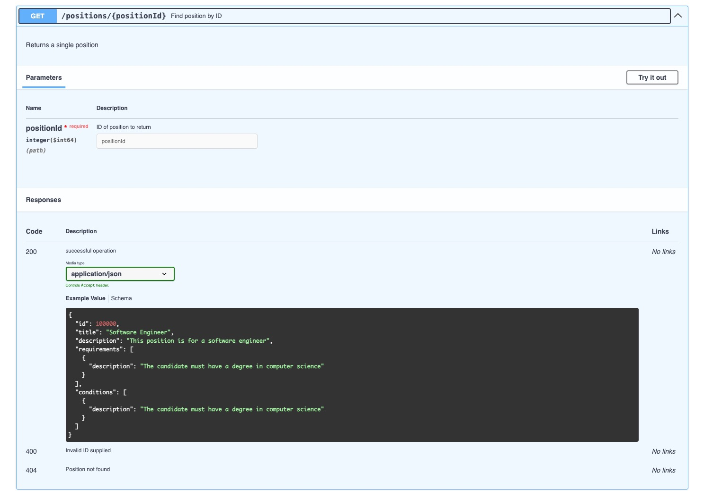
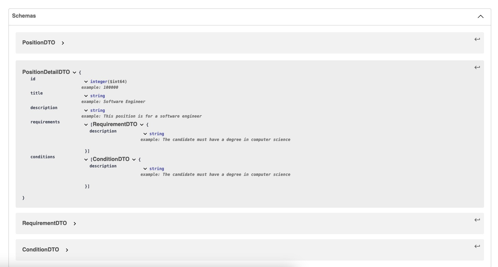
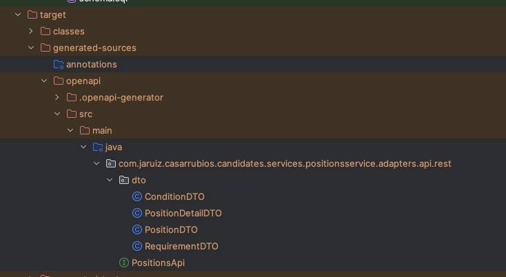

# API First with OpenAPI

API-First is a design and development approach where APIs are treated as the primary building blocks of an application. What does this mean? Let me try to explain it as simply as possible: in many projects or companies, when an integration is needed between systems, applications or even, third-parties, third parties, the process often involves coding the API first and then generating the documentation for the consumer to be able to invoke it. 

This approach usually generates conflicts because the consumers needs more data or they are not agree with the implementation because it's not useful.

How can we work better? Defining contracts.


## API Contract

The idea is to design and define the API before coding it. In this process, a contract is generated. What does this contact include?

- Operational data: how is the information shared? that means channels, methods, security, errors, quotas, throughput and so on.
- Informational data: what information is going to be shared? that means content and format and schemas


Usually, when we work with  synchronous APIs, we talk about swagger or Open API. **OpenAPI** is a widely adopted specification for designing, documenting, and describing RESTful APIs. It provides a structured way to define an API's operations, endpoints, parameters, responses, authentication methods, and more.

Let's see the project "project/candidates/backend/services/positions-service". If we go to resources folder, we find the file "api-spec/positionsservice-openapi.yaml". This file is the definition and the contract for the Positions API.

You can import this file in the [Swagger Editor](https://editor.swagger.io/) to see the definition in a more readable way that the YAML file. For instance:


- **Operational contract**

  


- **Informational contract**

  


## Generating code

Once we've defined the contract, we can generate code from the YAML file. Why? Because by this way, we are assuring that what we are agreeing in the contract is what we are going to build. Then, if we have a CI/CD pipelines, when the contract changes (the YAML file), those changes will be applied automatically in the code (and probably, it breaks the code)

The first step is configuring the Maven plugin:

```
<plugin>
    <groupId>org.openapitools</groupId>
    <artifactId>openapi-generator-maven-plugin</artifactId>
    <version>${openapi-generator.version}</version>
    <executions>
        <execution>
            <id>generate-api-code</id>
            <goals>
                <goal>generate</goal>
            </goals>
            <configuration>
              <inputSpec>${project.basedir}/src/main/resources/api-spec/positionsservice-openapi.yaml</inputSpec>
              <output>${project.build.directory}/generated-sources/openapi/</output>
              <generateApiDocumentation>false</generateApiDocumentation>
              <generateModelDocumentation>false</generateModelDocumentation>
              <generatorName>spring</generatorName>
              <generateApiTests>false</generateApiTests>
              <generateModelTests>false</generateModelTests>
              <skipOperationExample>true</skipOperationExample>
              <generateSupportingFiles>false</generateSupportingFiles>
              <configOptions>
                  <useSpringBoot3>true</useSpringBoot3>
                  <booleanGetterPrefix>is</booleanGetterPrefix>
                  <interfaceOnly>true</interfaceOnly>
                  <skipDefaultInterface>true</skipDefaultInterface>
                  <readOnly>true</readOnly>
                  <useTags>true</useTags>
                  <apiPackage>com.jaruiz.casarrubios.candidates.services.positions.adapters.api.rest</apiPackage>
                  <modelPackage>com.jaruiz.casarrubios.candidates.services.positions.adapters.api.rest.dto</modelPackage>
              </configOptions>
            </configuration>
        </execution>
    </executions>
</plugin>
```


You can check the configuration options [here](https://github.com/OpenAPITools/openapi-generator/tree/master/modules/openapi-generator-maven-plugin). The most important options are:

- inputSpec: location of the openapi file
- output: location where it's going to generate classes
- apiPackage: package for the interface
- modelPackage: package for the dots


Now, if you excute, for instance:

```
mvn clean compile
```


Code will be generated in the folder /generated-sources/openapi/ :




It's generated an interface:

```
@Generated(value = "org.openapitools.codegen.languages.SpringCodegen", date = "2024-11-28T23:52:03.512036+01:00[Europe/Madrid]", comments = "Generator version: 7.10.0")
@Validated
@Tag(name = "positions", description = "Operations about positions")
public interface PositionsApi {
...
}
```


The name of the interface corresponds to the parameter tag in the definition:

```yaml
tags:
  - name: positions
    description: Operations about positions
```


If we define more than one tag, multiple interfaces will be generated.


The name of the method corresponds to the "operationId" parameter in the definition file. For instance, as we've defined this operationId:

```
paths:
    /positions:
      get:
        summary: Find all the open positions
        description: Returns all the open positions for candidates to apply
        operationId: getAllPositions
        tags:
          - positions
        responses:
          '200':
            description: successful operation
            content:
              application/json:
                schema:
                  type: array
                  items:
                    $ref: '#/components/schemas/PositionDTO'
```


A method with the same name is added to the API Interface:

```java
/**
 * GET /positions : Find all the open positions
 * Returns all the open positions for candidates to apply
 *
 * @return successful operation (status code 200)
 */
@Operation(
    operationId = "getAllPositions",
    summary = "Find all the open positions",
    description = "Returns all the open positions for candidates to apply",
    tags = { "positions" },
    responses = {
        @ApiResponse(responseCode = "200", description = "successful operation", content = {
            @Content(mediaType = "application/json", array = @ArraySchema(schema = @Schema(implementation = PositionDTO.class)))
        })
    }
)
@RequestMapping(
    method = RequestMethod.GET,
    value = "/positions",
    produces = { "application/json" }
)

ResponseEntity<List<PositionDTO>> getAllPositions()
```


So, once we have generated the interface and the DTOs, we only have to reference it in the implementation and coding the methods:

```java
@RestController
public class PositionsRestController implements PositionsApi {
  
  public ResponseEntity<PositionDetailDTO> getPositionDetail(Long positionId) {
    ...
  }
  
   public ResponseEntity<List<PositionDTO>> getAllPositions() {
     ...
   }  
}
```


