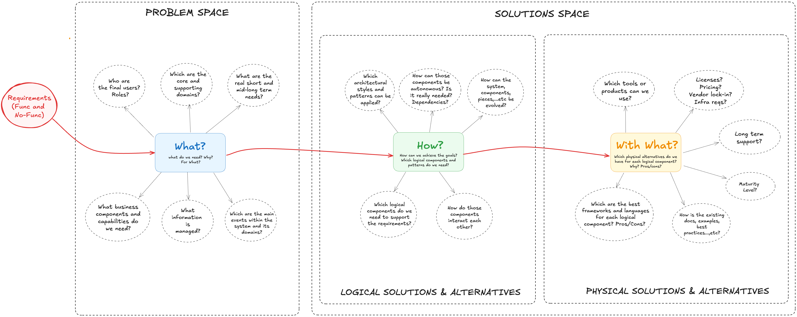
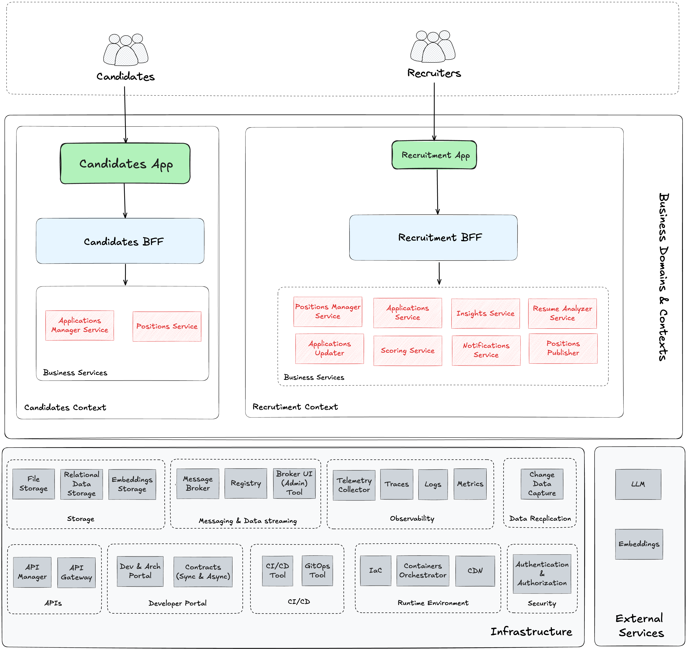
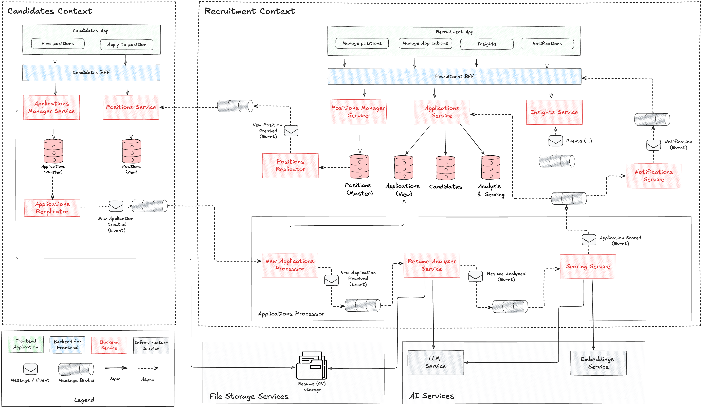
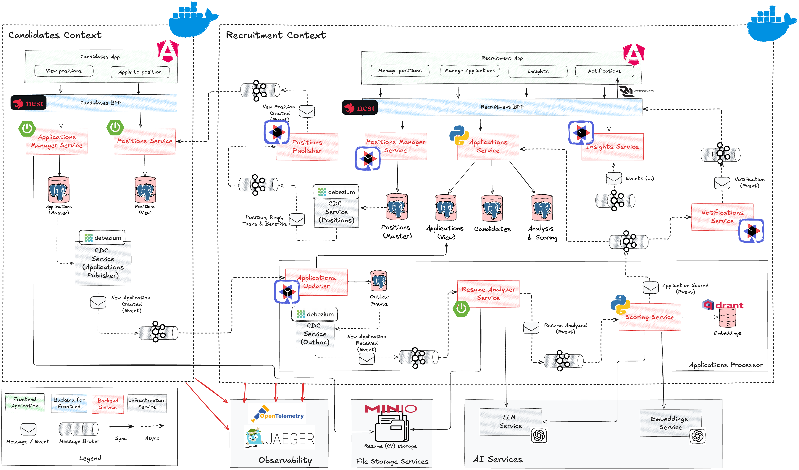

# Architecture

The project architecture is presented in a layered approach, starting from the business architecture and progressing to the physical implementation.

 

### Business and Information Architecture (What?)

This section defines the business (or functional) architecture of the project.

The following diagram illustrates the two distinct contexts (candidates and recruitment), the identified use cases, and how they are supported by various services:

 

The **information architecture** supporting both contexts is defined as follows:

 

As shown in the diagram, entities like "Position" and "Application" exist in both contexts. The design intentionally keeps these contexts separated to allow them to evolve independently. This approach uses concepts of "master data" and "replicated data" (or "projections"):

- **Candidates Context**:

    - **Position**: Represents job offers. This is a projection from the recruitment context. Within the candidate context, positions are read-only and never created here.

    - **Application**: Corresponds to applications for job positions. The Candidates context is the owner of this information structure. Applications are created in the Candidates context and propagated to the Recruitment context. An application contains a key, candidate information (name, email, phone), and a CV file.

- **Recruitment Context**:

    - **Position**: Represents job offers. The Recruitment context is the owner of this entity.

      Positions are created in this context and propagated to the Candidates context. A position contains:
        - Key: Unique identifier
        - Title: Position name
        - Description: Detailed information about the position
        - Requirements: List of skills and qualifications
        - Responsibilities: List of job duties
        - Benefits: List of perks offered

      Each requirement contains:
        - Key: Identifies the requirement (e.g., "Java", "Python", "Project Management", "Agile")
        - Value: Level of expertise (1=Beginner, 2=Intermediate, 3=Advanced)
        - Description: Additional details about the requirement
        - Mandatory: Boolean indicating whether the requirement is essential or optional

      Responsibilities (e.g., "Develop solutions based on Microservices and Kafka") and Benefits (e.g., "Remote work") only contain descriptions.

    - **Application**: A projection of applications from the Candidates context. In this context, an application represents the relationship between a candidate, a position, and a scoring, indicating that a candidate has applied to a position and received a matching score.

    - **Candidate**: An independent entity extracted from the application data. Keeping candidate information separate allows for analysis independent of the positions applied for and enables future capabilities such as finding the best candidate for a specific position.

    - **Candidate Analysis**: Contains the analysis performed on the candidate's resume. This structure may evolve in the future to include additional analytical fields.

    - **Scoring**: Represents the percentage match between a candidate and the position applied for. This structure may evolve to include more detailed scoring metrics in the future.

 

### Logical Architecture (How?)

I designed this logical architecture showing the main pieces I need to develop and execute the "AI Recruitment System":

> **Note:** From this diagram, several physical approaches or architectures can be built. Not all of them will include all the pieces shown or they will be added in the future. For instance, in the local runtime environment with Docker Compose, components like GitOps Tool or CDN are not included

 

Once we have seen all the different components we need, the next step I took was to create a diagram illustrating how the main components will interact with each other.:

 

Below is a detailed description of the main components within its respective context:

##### Candidates Context

| Component                    | Description                                                  |
| ---------------------------- | ------------------------------------------------------------ |
| Candidates App               | Frontend application for candidates. It allows candidates to browse available positions and apply to them. |
| Candidates BFF               | Backend for Frontend (BFF) for the Candidates App. It manages interactions between the frontend and backend services. |
| Applications Manager Service | Manages applications submitted by candidates. Provides endpoints to submit applications. Resumés are stored in a File Storage Service |
| Positions Service            | Provides APIs to retrieve positions and their details.       |
| Applications Database        | Stores data related to submitted applications.               |
| Positions Database           | Stores positions data, including requirements, tasks, and benefits. This data is replicated from the Recruitment context. |
| Applications Replicator      | Captures changes in the Applications Database and publishes them to a message broker |

 

##### Recruitment Context

| Component                  | Description                                                  |
| -------------------------- | ------------------------------------------------------------ |
| Recruitment App            | Frontend application for recruiters. It allows them to manage positions, view them as candidates would, and review applications with associated scoring and analysis. |
| Recruitment BFF            | Backend for Frontend (BFF) for the Recruitment App. It orchestrates calls between the frontend and backend services. |
| Positions Manager Service  | Provides APIs to create, update, and retrieve positions and their details. |
| Positions Database         | Stores data related to positions, requirements, tasks and benefits |
| Positions Replicator       | Captures changes in the Positions Database (positions, requirements, tasks, benefits) and publishes them to a message broker |
| Applications Service       | Provides APIs to retrieve applications and their associated score and analysis. |
| Applications Database      | Stores data related to applications, candidates, analysis and scoring |
| Insights Service           | Consumes topics like positions and scoring, maintains an internal storage with insights and exposes it via REST API. |
| Notifications Service      | Consumes scoring topics and, when a score exceeds a threshold, publishes a notification to a message broker. These events are consumed by the BFF and pushed to the frontend |
| New Applications Processor | Consumes change data from applications CDC topics, processes them, and updates application tables. Implements the Outbox Pattern to publish “New Application Received” events and triggers the scoring and analysis pipeline. |
| Positions Analyzer Service | Processes “New Application Received” events, retrieves candidate data and resumés, extracts text from resumés, and prompts an LLM to extract insights. Once completed, it publishes a “Resumé Analyzed” event. |
| Scoring Service            | Processes “Resumé Analyzed” events and evaluates candidates against positions using embeddings (cosine similarity). It also prompts an LLM to generate a natural language explanation of the score. |

 

 

### Physical Architectures (With What?)

In this section I'll expose several alternatives to implement each logical component.

 

In the picture above we can see some business components and some infrastructure components supporting them. Let's start with business components:

##### **Candidates Context**

| Logical Component            | Physical Component           | Technology    |
| ---------------------------- | ---------------------------- | ------------- |
| Candidates App               | Candidates App               | Angular       |
| Candidates BFF               | Candidates BFF               | NestJS (Node) |
| Applications Manager Service | Applications Manager Service | Spring Boot   |
| Positions Service            | Positions Service            | Spring Boot   |
| Applications Database        | Applications Database        | PostgreSQL    |
| Positions Database           | Positions Database           | PostgreSQL    |
| Applications Replicator      | Applications Publisher       | Debezium      |

 

##### **Recruitment Context**

| Logical Component          | Physical Component         | Technology              |
| -------------------------- | -------------------------- | ----------------------- |
| Recruitment App            | Recruitment App            | Angular                 |
| Recruitment BFF            | Recruitment BFF            | NestJS (Node)           |
| Positions Manager Service  | Positions Manager Service  | Quarkus                 |
| Positions Database         | Positions Database         | PostgreSQL              |
| Positions Replicator       | Positions CDC Service      | Debezium                |
| Positions Replicator       | Positions Publisher        | Quarkus (Kafka Streams) |
| Applications Service       | Applications Service       | Python                  |
| Applications Database      | Applications Database      | PostgreSQL              |
| Insights Service           | Insights Service           | Quarkus (Kafka Streams) |
| Notifications Service      | Notifications Service      | Quarkus                 |
| New Applications Processor | Applications Updater       | Quarkus (Outbox)        |
| New Applications Processor | Outbox CDC Service         | Debezium                |
| New Applications Processor | Outbox table               | PostgreSQL              |
| Positions Analyzer Service | Positions Analyzer Service | Spring Boot             |
| Scoring Service            | Scoring Service            | Python                  |

 

Now, let's check **infrastructure components**:

| Component               | Technology     | Description                                                  |
| ----------------------- | -------------- | ------------------------------------------------------------ |
| Streaming Tool          | Kafka          | It allows publishing and consuming messages between components and provides streaming capabilities |
| Change Data Capture     | Debezium       | It detects changes in databases and publishes them to Kafka  |
| Relational Database     | PostgreSQL     | It stores relational information                             |
| File Storage            | Minio          | It used to store resumé files                                |
| LLM                     | Open AI        | It uses to analyse resumés and get score explanations        |
| Embeddings Generator    | Open AI        | It generates embeddings from texts                           |
| Embeddings Database     | Qdrant         | It stores embeddings calculated                              |
| Observability collector | OTEL Collector | It receives, processes and exports telemetry data            |
| Tracing tool            | Jaeger         | It shows traces within executions                            |

 
