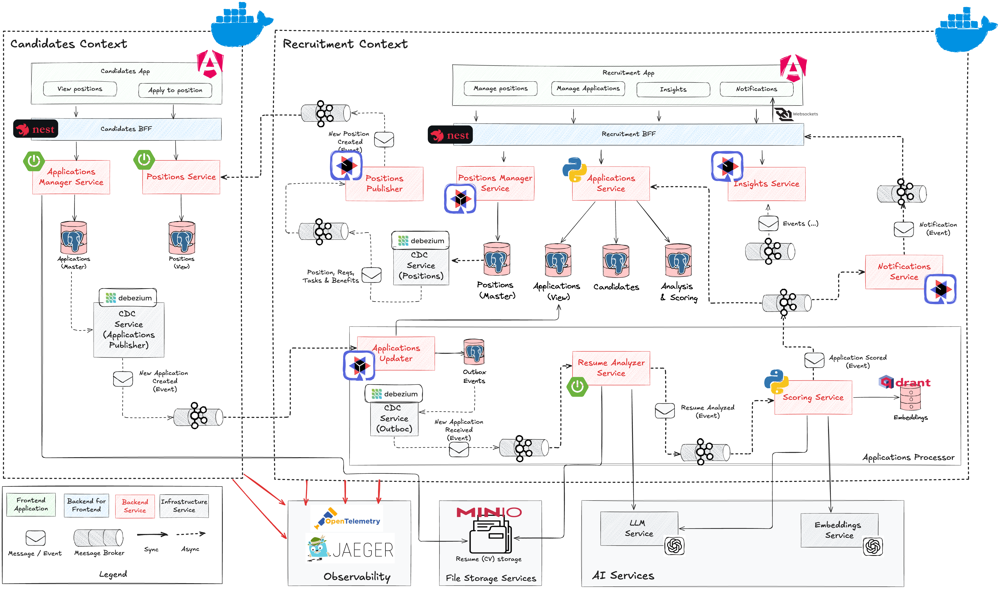

# Deployment Architecture

This document describes the deployment architectures supported by the project across different runtime environments.

## Overview

The AI-powered recruitment system supports multiple deployment targets, each optimized for different purposes:

- **Local Development** (Docker Compose) - Current implementation
- **Kubernetes** (Planned) - Production-ready container orchestration
- **Cloud Platforms** (Future) - AWS, Azure with Infrastructure as Code

## Current State: Docker Compose Deployment

### Purpose
- Local development and testing
- Quick demo and POC environments
- Full-stack integration testing
- Platform-agnostic local runtime

### Architecture



**Infrastructure Components:**
- **Docker Compose**: Container orchestration
- **Docker Networks**: Service isolation and communication
- **Volumes**: Data persistence for databases and storage
- **Environment Variables**: Configuration management

**Service Organization:**
```
platform/local/
├── docker-compose.yml           # Main compose file
├── connectors/                  # Debezium connector configurations
├── postgres/                    # Database initialization scripts
└── configs/                     # Service configurations
```

### Service Deployment

**Frontend Services:**
- Candidates App: Nginx serving Angular app on port 8081
- Recruitment App: Nginx serving Angular app on port 9070

**BFF Services:**
- Candidates BFF: NestJS on port 8080
- Recruitment BFF: NestJS on port 9071

**Backend Services (Candidates Context):**
- Applications Manager: Spring Boot on port 8090
- Positions Service: Spring Boot on port 8080

**Backend Services (Recruitment Context):**
- Positions Manager: Quarkus on port 9072
- Positions Publisher: Quarkus/Kafka Streams (transforms CDC events to business events)
- Applications Service: Python/FastAPI on port 9073
- Resume Analyzer: Spring Boot on port 9082
- Scoring Service: Python (internal service, no exposed port)
- Insights Service: Quarkus/Kafka Streams on port 9090
- Notifications Service: Quarkus (internal service, no exposed port)
- Applications Updater: Quarkus (internal service, no exposed port)

**Infrastructure Services:**
- PostgreSQL: Port 5432 (candidates, recruitment databases)
- Kafka: Port 9092 (internal), 9093 (external)
- Zookeeper: Port 2181
- Kafka Connect: Port 8083
- Kafka UI: Port 8001
- Minio: Port 9000 (API), 9001 (Console)
- Qdrant: Port 6333
- Jaeger: Port 16686 (UI), 14268 (collector)
- OTEL Collector: Port 4317 (gRPC), 4318 (HTTP)

### Networking

**Docker Networks:**
- `casarrubios-network`: Default network for all services
- Automatic DNS resolution via service names

**Service Communication:**
- Internal: Services use Docker DNS (e.g., `http://kafka:9092`)
- External: Host ports mapped for local access
- Security: Services only expose necessary ports to host

### Data Persistence

**Docker Volumes:**
```yaml
postgres_data:       # PostgreSQL databases
kafka_data:          # Kafka logs and topics
zookeeper_data:      # Zookeeper state
minio_data:          # Object storage (resumes)
qdrant_data:         # Vector embeddings
```

**Backup Strategy (Local):**
- Manual volume backups for development
- Database dumps for data preservation
- No automated backup in local environment

### Configuration Management

**Environment Variables:**
- `OPENAI_API_KEY`: Required for AI services
- Database credentials configured in compose file
- Service-specific config via ENV vars

**Configuration Files:**
- Debezium connectors: JSON configs in `/connectors`
- Database init: SQL scripts in `/postgres`
- Application configs: Embedded in service images

### Deployment Procedure

**Prerequisites:**
```bash
# Required software
- Docker 20.10+
- Docker Compose 2.0+
- OpenAI API Key

# System resources (minimum)
- 8 GB RAM
- 20 GB disk space
- 4 CPU cores
```

**Startup Sequence:**
```bash
# 1. Set OpenAI API key
export OPENAI_API_KEY=<your-key>

# 2. Navigate to platform directory
cd platform/local

# 3. Start all services
docker-compose up -d

# 4. Wait for services to be healthy
docker-compose ps

# 5. Configure Debezium connectors
./setup-connectors.sh  # If available
```

**Service Dependencies:**
1. Infrastructure (PostgreSQL, Kafka, Zookeeper) starts first
2. Databases initialize schemas and seed data
3. Backend services wait for dependencies
4. Debezium connectors configured after services are ready
5. Frontend apps served last

**Health Checks:**
- Most services expose `/health` or `/actuator/health` endpoints
- Docker Compose health checks ensure proper startup order
- Kafka Connect readiness verified via REST API

### Monitoring (Local)

**Available Tools:**
- **Kafka UI** (http://localhost:8001): Topic monitoring, consumer lag
- **Jaeger** (http://localhost:16686): Distributed tracing
- **Minio Console** (http://localhost:9001): Object storage management
- **Service Logs**: `docker-compose logs -f <service>`

**Key Metrics:**
- Container resource usage: `docker stats`
- Service logs: `docker-compose logs`
- Kafka lag: Via Kafka UI
- Trace spans: Via Jaeger UI

### Limitations

- **Not production-ready**: No HA, no auto-scaling
- **Single host**: All services on one machine
- **Manual scaling**: No horizontal pod autoscaling
- **Limited monitoring**: No Prometheus/Grafana setup
- **No secrets management**: Env vars in plaintext
- **Development only**: Not suitable for production workloads

---

## Planned: Kubernetes Deployment

> **Status**: 🔄 In Progress (see TODO.md and README.md short-term goals)

### Objectives
- Production-ready deployment with HA
- Auto-scaling based on load
- Rolling updates with zero downtime
- Enhanced monitoring and observability
- Secret management with Kubernetes Secrets
- Infrastructure as Code (Helm charts)

### Planned Components

**Kubernetes Resources:**
- **Deployments**: For stateless services (BFFs, business services)
- **StatefulSets**: For stateful services (databases, Kafka)
- **Services**: ClusterIP for internal, LoadBalancer for external
- **ConfigMaps**: Application configuration
- **Secrets**: Sensitive data (API keys, credentials)
- **PersistentVolumeClaims**: Data persistence
- **HorizontalPodAutoscaler**: Auto-scaling policies

**Infrastructure:**
- **Helm**: Package manager for Kubernetes
- **Ingress Controller**: API Gateway (Kong planned)
- **Service Mesh**: (Consideration for future)
- **Cert Manager**: TLS certificate management

### Deployment Strategy

**Helm Charts Structure (Planned):**
```
platform/k8s/
├── helm/
│   ├── casarrubios/              # Umbrella chart
│   ├── candidates/               # Candidates context services
│   ├── recruitment/              # Recruitment context services
│   ├── infrastructure/           # Kafka, PostgreSQL, etc.
│   └── monitoring/               # Prometheus, Grafana
```

**Namespace Organization:**
```
- casarrubios-candidates     # Candidates bounded context
- casarrubios-recruitment    # Recruitment bounded context
- casarrubios-infrastructure # Shared infrastructure (Kafka, DBs)
- casarrubios-monitoring     # Observability stack
```

**GitOps Workflow:**
- Git repository as single source of truth
- ArgoCD or Flux for continuous deployment
- Automated sync from Git to cluster
- Declarative configuration

### Scalability

**Horizontal Pod Autoscaling (HPA):**
- BFF services: Scale based on CPU/requests per second
- Business services: Scale based on CPU and memory
- Kafka consumers: Scale based on consumer lag
- Kafka Streams: Partition-aware scaling

**Resource Limits:**
```yaml
resources:
  requests:
    memory: "512Mi"
    cpu: "250m"
  limits:
    memory: "1Gi"
    cpu: "500m"
```

### High Availability

**Multi-replica deployments:**
- Frontend/BFF: 2+ replicas
- Business services: 2+ replicas
- Kafka brokers: 3 replicas (quorum)
- PostgreSQL: Primary-standby with streaming replication

**Pod Disruption Budgets:**
- Ensure minimum replicas during updates
- Prevent simultaneous pod evictions

**Readiness & Liveness Probes:**
- Ensure traffic only to healthy pods
- Auto-restart unhealthy containers

---

## Future: Cloud Platform Deployment

> **Status**: 📋 Planned (see README.md mid-term goals)

### Infrastructure as Code (IaC)

**Terraform Modules (Planned):**
```
platform/iac/
├── aws/                    # AWS-specific infrastructure
│   ├── eks/               # EKS cluster
│   ├── rds/               # PostgreSQL RDS
│   ├── msk/               # Managed Kafka (MSK)
│   ├── s3/                # Object storage
│   └── vpc/               # Network configuration
└── azure/                  # Azure-specific infrastructure
    ├── aks/               # AKS cluster
    ├── postgresql/        # Azure Database for PostgreSQL
    ├── eventhub/          # Event streaming
    └── storage/           # Blob storage
```

### AWS Deployment Architecture (Planned)

**Managed Services:**
- **EKS**: Kubernetes cluster management
- **RDS PostgreSQL**: Managed relational databases
- **MSK**: Managed Kafka service
- **S3**: Resume file storage (replacing Minio)
- **ALB**: Application Load Balancer with Ingress
- **Route53**: DNS management
- **ACM**: SSL/TLS certificates
- **CloudWatch**: Logging and metrics

**Security:**
- **IAM Roles**: Service authentication
- **Secrets Manager**: Sensitive data storage
- **VPC**: Network isolation
- **Security Groups**: Network access control
- **WAF**: Web Application Firewall

### Azure Deployment Architecture (Planned)

**Managed Services:**
- **AKS**: Kubernetes cluster
- **Azure Database for PostgreSQL**: Managed databases
- **Event Hubs**: Event streaming
- **Blob Storage**: File storage
- **Application Gateway**: Load balancing
- **Azure DNS**: Domain management
- **Key Vault**: Secrets management
- **Azure Monitor**: Observability

### Multi-Cloud Strategy

**Abstraction Layers:**
- Kubernetes provides platform abstraction
- Cloud-agnostic service definitions (Helm charts)
- Provider-specific infrastructure (Terraform)
- Avoid cloud-specific services in application code

**Trade-offs:**
- Portability vs managed service benefits
- Cost vs control
- Learning curve vs productivity

---

## Deployment Comparison Matrix

| Aspect | Docker Compose | Kubernetes | Cloud (AWS/Azure) |
|--------|---------------|------------|-------------------|
| **Purpose** | Local dev, demos | Production | Production at scale |
| **Status** | ✅ Implemented | 🔄 In Progress | 📋 Planned |
| **Orchestration** | Docker Compose | K8s | Managed K8s (EKS/AKS) |
| **Scaling** | Manual | Auto (HPA) | Auto + managed services |
| **HA** | ❌ No | ✅ Yes | ✅ Yes (multi-AZ) |
| **Monitoring** | Basic (Jaeger, Kafka UI) | Prometheus/Grafana | CloudWatch/Monitor |
| **Secrets** | Env vars | K8s Secrets | Secrets Manager/Key Vault |
| **Cost** | Low (local) | Medium (self-managed) | Higher (managed) |
| **Complexity** | Low | Medium | High |
| **Best For** | Development | On-premise prod | Cloud-native prod |

---

## CI/CD Integration

### Current: GitHub Actions

**Pipeline Stages:**
1. **Build**: Compile and test code
2. **Package**: Create Docker images
3. **Publish**: Push to GitHub Packages
4. **Deploy**: Manual (docker-compose pull)

See [CI/CD documentation](../../README.md#cicd) for details.

### Planned: GitOps with ArgoCD

**GitOps Flow:**
```
Code Push → GitHub Actions → Build & Test → Push Image → 
Update Helm Chart → Git Commit → ArgoCD Sync → K8s Deploy
```

**Benefits:**
- Git as single source of truth
- Declarative deployments
- Automated rollback capabilities
- Audit trail via Git history

---

## Migration Path

### Phase 1: Local Development (✅ Complete)
- Docker Compose setup
- All services containerized
- Basic monitoring (Jaeger, Kafka UI)

### Phase 2: Kubernetes Setup (🔄 In Progress)
- Create Helm charts
- Deploy to local K8s (minikube/kind)
- Configure Ingress and networking
- Set up basic monitoring

### Phase 3: Production Readiness (📋 Planned)
- Implement GitOps workflow
- Add comprehensive monitoring
- Configure auto-scaling
- Implement secrets management
- Security hardening

### Phase 4: Cloud Migration (📋 Future)
- Infrastructure as Code (Terraform)
- Migrate to managed services
- Multi-region deployment
- Disaster recovery setup

---

## Related Documentation

- [Architecture Overview](architecture.md)
- [Technical Requirements](tech_reqs.md)
- [ADR-001: Polyglot Architecture](../../adrs/001-polyglot-architecture.md)
- [ADR-002: Event-Driven Architecture](../../adrs/002-event-driven-architecture.md)
- [Project README](../../../README.md)

---

## References

- Docker Compose: https://docs.docker.com/compose/
- Kubernetes: https://kubernetes.io/docs/
- Helm: https://helm.sh/docs/
- ArgoCD: https://argo-cd.readthedocs.io/
- Terraform: https://www.terraform.io/docs/
