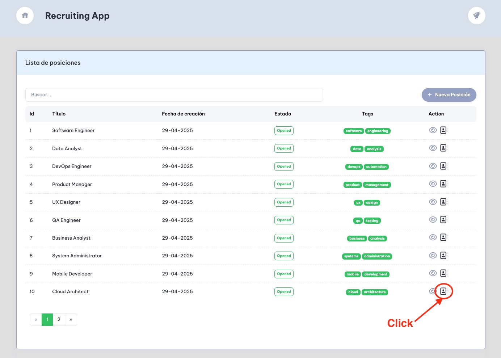

# Quick Demo Guide

In this section, we will provide a quick demo of the core functionalities of the recruitment platform. This guide is intended to quickly understand how to use the platform without going into too much detail.


## Prerequisites
- Ensure you have Docker and Docker Compose installed on your machine.
- Clone the repository to your local machine.
- Navigate to 'platform/local' folder
- Run the following command to start the local environment:
```bash
docker-compose up -d
```


> **Note:** Be patient. Wait for all services to start and the data to be replicated (in a Macbook Pro M1 with 16gb RAM it takes about 4-5 min)


## Checking replicated data

Once CDC Service is up and running and the Debezium connectors are installed, initial positions loaded into positions table of recruitment context are replicated to positions table of candidates context. 

This process is known as "**Snapshot**" and consists of taking all the data from the tables registered in the connector to the target tables. If you check the  logs by using " docker-compose logs cdc-service", you'll see something like these lines:


You can also use the provided "***PgAdmin***" tool to check directly the positions table of the candidates schema. To do that, go to http://localhost:5433/


> **Note:** User is "admin@admin.com" and password is "admin"


Then, create a new server and check positions table of candidates schema:


<br />

Now, in the "Connection" section, introduce the parameters of Postgres database:

- Hostname: postgresql
- Port: 5432
- Database: applications
- Username: postgres
- Password: postgres


<br />

Click in "Save". Once server is created, go to "*applications*" database, then "*schemas*", select "*applications->tables->positions*" and right click to go to "View/Edit Tables"


<br />

You should be "*some positions*" loaded in the table:


<br />

Once this data is loaded, everything is ready for the demo


## Demo

For this demo, we are going to use the following URLs:

| Application / Tool | URL                           | Description                                                 |
| ------------------ | ----------------------------- | ----------------------------------------------------------- |
| Recruitment App    | http://localhost:9070/        | Recruitment App                                             |
| Candidates App     | http://localhost:8081/        | Candidates App                                              |
| PgAdmin            | http://localhost:5433/        | Postgresql UI Tool                                          |
| Kafka UI           | http://localhost:8001/        | Kafka UI Tool                                               |
| Jaeger             | http://localhost:16686/search | Jaeger (Traceability Tool)                                  |
| Minio              | http://localhost:9001/login   | Object storage service (credentials: minioadmin/minioadmin) |


Now, let's go to the demo!


### Recruitment and Candidates apps

The first step is **open the recruitment app to show the list of the positions already loaded** in the system. So, open the [Recruiment App](http://localhost:9070/) in your browser:


<br />

As we said before, **all the positions data from recruitment context is replicated automatically to the candidates context by "cdc-service" (Debezium)**. 

If we open the [Candidates App](http://localhost:8081/), we will see the same data shown in recruitment app:


<br />


### Recruitment app: creating new position

From the Recruitment Home, click the 'Nueva Position' button. You will see an empty screen ready to be filled with all the data regarding the new position.


<br />

We are going to fill the required fields:


<br />

Once the test data is filled, click the "Guardar cambios" button.  

The data will be saved into position table (and associated tables) in the recruitment conext but **the information will be also replicated automatically to the candidates context by "cdc-service"**. If now, we go to the [candidates app home](http://localhost:8081/) and click the last positions page, will see the new position:


<br />

If we click the position row, we'll get its details:


<br />

You can also check the "cdc-service logs" and you should see something like this line (execute '*docker-compose logs cdc-service*'):

```
infrastructure.cdc-service  | [2025-04-29 15:25:59,697] INFO [recruiters-positions-cdc-connector|task-0] 1 records sent during previous 01:08:53.575, last recorded offset of {server=cdc} partition is {lsn_proc=25260128, messageType=INSERT, lsn_commit=25252048, lsn=25260128, txId=830, ts_usec=1745940358784236} (io.debezium.connector.common.BaseSourceTask:352)
```


And you can also **check candidates tables** (*using [PgAdmin tool](http://localhost:5433/) for instance*) to really verify that the data has been replicated. 


<br />

**What is happening behind the scenes?** 


<br />

Let's see in more detail. 

When position data is saved (within a transaction) into the different tables, **Debezium detects those changes and publishes them into several Kafka topics**:


<br />

We need to aggregate the information contained in those topic into a single Position entity (position data, requirements, tasks and benefits). For getting this aggregation, we have options like the outbox pattern (we will talk about it later) but, for this use case, I've implemented a Kafka Stream (using Processor API):


<br />

The information is aggregated into an event that is consumed by "positions service" in the Candidates context to feed its positions view:


<br />

### Recruitment app: showing position detail / edit position

Now, click in a position to show the position detail. For instance, click on the position with id 10, "Cloud Architect":


<br />

If you do scroll down, you'll see tasks and benefits. In this section, you can also update the position data and save it. 


> **Note:** As we have seen before, all the updated data will be replicated to candidates context. So, you can open this position in the candidates app and check that changes have been applied


### Recruitment app: candidate view

From the recruitment application is possible to check how a position is going to be shown to the candidates. Click the  from any row of the positions list to get this feature:


<br />

### Candidates app: positions list

As we've already seen, positions are replicated from Recruitment context to Candidates context. So, if we open the [candidates app](http://localhost:8081/) we will see the list of the positions we can apply:


<br />

### Candidates app: applying to a position

To apply to a position, just click on the row you choose and go to the position detail. For this demo, we are choosing to apply to "Cloud Architect" one (row with id number 10):


<br />

To apply, click the "Aplicar" button and fill the required fields:


<br />


<br />

Once the data is saved, as the same way that positions are replicated from recruitment context to candidates context, **applications are also replicated from candidates context to position context**. 

This is what happens behind the scenes:


<br />

Applications data is written to applications table and the attached resumé is stored in Minio. **Once data is written to applications table, Debezium reads that change and publish a message to "cdc.applications.applications" topic**. 

If you go to [Kafka UI Tool](http://localhost:8001/), open that topic and check if there are new messages, you'll find a new one similar to this:


<br />

We can also **check application tables within the recruitment database schema**. In this case, the "Applications Updater" service, adapts the published data in the topic to the target database model, consisting of two tables:


<br />


<br />

### Recruitment: scoring process

Besides managing cdc message and storing the information regarding the application submitted in the recruitment tables, at the same time, **the scoring process is triggered**:


<br />

The "Applications Updater" writes application and candidate data feeding the applications view tables (candidates_applications and candidates) but, **in the same transaction, it also writes information into the outbox table**. **In this table, it writes information about "New Application Received Event":**


<br />

If we go to the payload column, we will see a json like this:
```json
{
	"id":"d00f792f-eb02-4672-860c-da1ad21e39ad",
	"candidateId":"a5c01d37-1e5f-4a8f-97b9-af4e5c3ad6ad",
	"positionId":10,
	"createdAt":1745965232587517
}
```

<br />

Once the transaction is committed to the different tables, including this one, Debezium reads the changes associated with the Outbox Table and publish the "New Application Received Event" to Kafka (topic: "recruitment.applications-received"):


This is known as "The Outbox Pattern":


[The outbox pattern]: https://microservices.io/patterns/data/transactional-outbox.html

<br />

Now, **the "Resume Analyzer Service" consumes this event and performs these actions**:

1. gets the resumé from Minio, 
2. converts the file into text, 
3. calls to LLM pasing that text and 
4. publishes "Resume Analyzed Event"


<br />

**The "Scoring Service" consumes this event and performs these actions**:

1. gets position data
2. executes an scoring algorithm comparing position data against resumé analysis:
   - converts text to embeddings using the LLM service
   - stores embeddings in the Vector Database to avoid re-calculate position embeddings again and again (candidate information is unique from each candidate, position data is the same for all the candidates)
   - calculates cosine distance between embeddings
   - finally, when all the different percentages are calculated, calls to the LLM service to get the scoring explanation. In this case, a light model is used in order to reduce cost.
3. publishes an **"Application Scored Event"** to Kafka


<br />

Finaly, **this event is consumed by the "applications service" that stores the analysis and scoring service into the database tables** to be shown in the frontend app when needed:


<br />

> **Note:** probably, **in later versions, this information was moved to a NoSQL database** (or even stored as JSON in PostgreSQL), but for this MVP, I preferred not to add more infrastructure components to the ecosystem. 


### Recruitment: notifications

The  "Application Scored Event" is also consumed by the "notifications service" that emits a notification if the scoring is greater than a configured value (~60%). If the condition is satisfied, the "Notifications service" publishes a notification to Kafka. This notification is consumed by the BFF that, by using Websockets, pushes the notification to frontend application:


<br />

In this case, if we go again (not refreshing) to the [Recruitment App](http://localhost:9070/), we'll see how a notification badge is shown:


<br />

And if we click on the notifications icon, the notification is shown:


<br />

### Recruitment: analysis and scoring information

In this moment, we can consult analysis and scoring information in the  [Recruitment App](http://localhost:9070/). Go to the positions list, and click in the "applications icon" of the position where the resumé was submitted:



<br />

The applications to that position are shown:


<br />

Now, if we click on the row, we will access to the analysis and scoring information:

- Scoring

  < <br />

- Analysis summary:

  

  <br />

- Candidate strengths:

  

  <br />

-  Candidate concerns:

  

  <br />

- Candidate responsibilities:

  

  <br />

- Candidate skills:

  

  <br />

- Possible interview questions about the candidate resumé:

  

