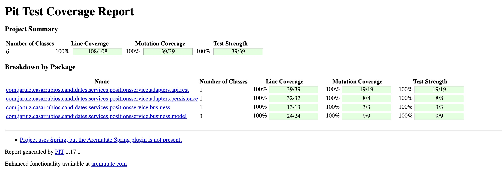

# Mutation testing


## **What is Mutation Testing?**

Mutation testing is a technique used to evaluate the quality of your tests. What does it mean? Mutation testing introducing small changes (mutations) to your code and checking if your tests can detect these changes. If a test fails due to a mutation, it means the test "kills" the mutation, indicating the test is effective. If no test fails, the mutation "survives," signaling a potential weakness in your test coverage.


This means that if you have implemented poor assets and you are not checking wether the result of the test is the expected, you have an useless test battery.

For instance, if you have a test like this one:

```java
final Position position = positionService.getPositionDetail(1L);
assertNotNull(position);
```

and the code associated to Position changes (add or remove attributes, types, etc), this test will keep green but it's probably that the application doesn't work as expected. This kind of test isn't an strong test


## **How to Implement Mutation Testing**

The first step is to configure in the `pom.xml` file using the `pitest-maven` plugin. Below is the relevant configuration:

```xml

<plugin>
    <groupId>org.pitest</groupId>
    <artifactId>pitest-maven</artifactId>
    <version>1.17.1</version>
    <executions>
        <execution>
            <id>pitest</id>
            <phase>test</phase>
            <goals>
                <goal>mutationCoverage</goal>
            </goals>
        </execution>
    </executions>
    <dependencies>
        <dependency>
            <groupId>org.pitest</groupId>
            <artifactId>pitest-junit5-plugin</artifactId>
            <version>1.2.1</version>
        </dependency>
    </dependencies>
    <configuration>
        <timeoutConstant>15000</timeoutConstant>
        <verbose>true</verbose>
        <targetClasses>
            <param>com.jaruiz.casarrubios.candidates.services.positions.*</param>
        </targetClasses>
        <targetTests>
            <param>com.jaruiz.casarrubios.candidates.services.positions.*</param>
        </targetTests>
        <features>
            <feature>+auto_threads</feature>
        </features>
        <excludedClasses>
            <param>com.jaruiz.casarrubios.candidates.services.positions.adapters.api.rest.dto.*</param>
            <param>com.jaruiz.casarrubios.candidates.services.positions.adapters.persistence.postgresql.entities.*</param>
        </excludedClasses>
    </configuration>
</plugin>
```


The most important properties are the following ones:

- Execution Phase: The mutation testing is executed during the test phase.
- Dependencies: The pitest-junit5-plugin is included to support JUnit 5.
- targetClasses: Specifies the classes to be mutated.
- targetTests: Specifies the tests to be run.
- excludedClasses: Excludes certain classes from mutation testing


## Running Mutation Tests

To run the mutation tests, execute the following Maven command:

```shell
mvn test
```

The mutation testing results are generated in the target/pit-reports directory. The results include detailed information about the mutations and whether they were detected by the tests.

To access the visual report, open the index.html file located in the target/pit-reports directory in a web browser. This report provides a comprehensive view of the mutation testing results, including the mutation coverage and details of each mutation:


