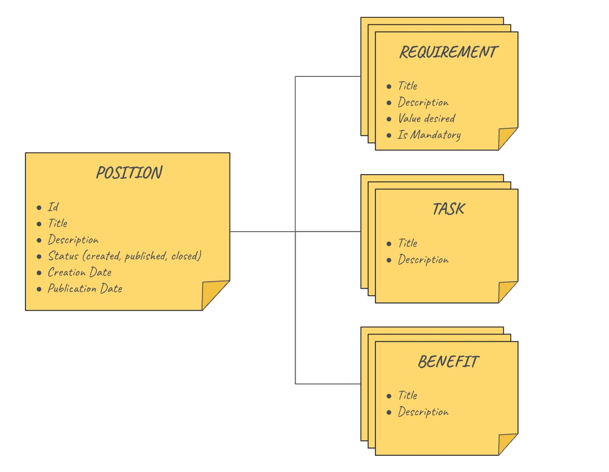

POSITIONS

This document contains the design about "positions".  The following picture shows how a "position" is composed:

Let's see in detail:

- A position has some basic properties like id, title, description and a creation and publication date. It also has a status which values can be "created", "published", "closed"
- Every position must have at least one requirement (for instance, "10 years of experience in Java")
- Every position must have at least one task (for instance, "design the technical solution")
- Every position must have at least one benefit ()