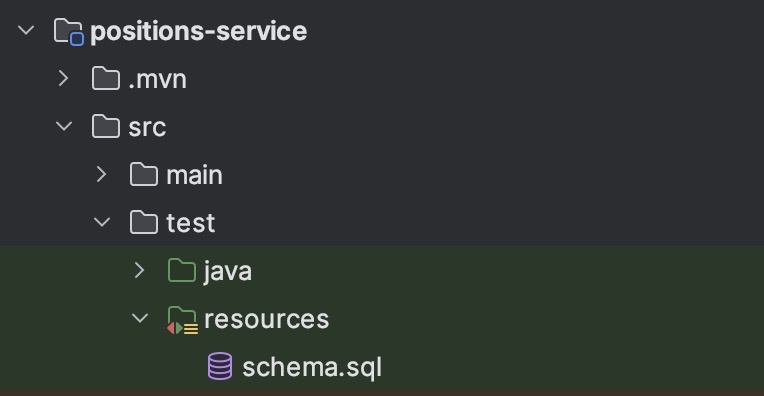
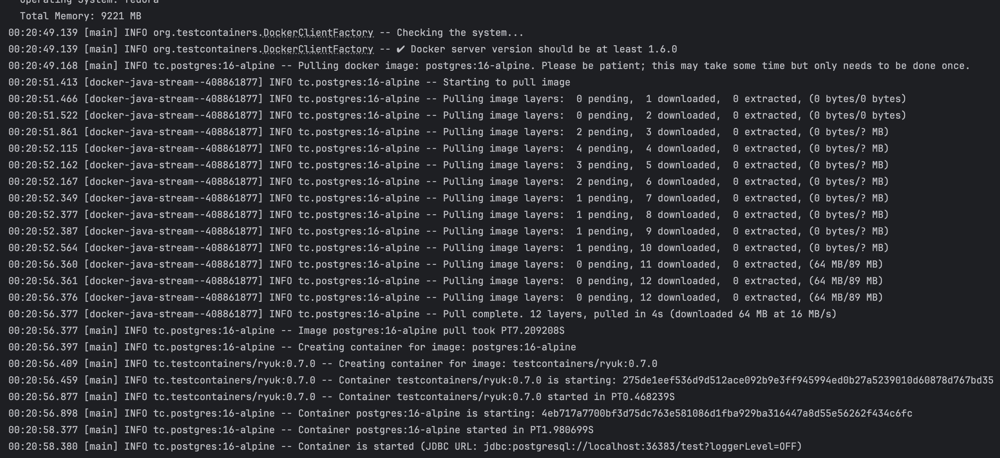

# Working with Testcontainers


## What is Testcontainers?

Testcontainers is a library to easily include some pieces of infrastructure that we need in our projects when we want to make integration tests. It's based on containers (Docker).

By using Testcontainers, we can include real databases, message brokers, web browsers, or just about anything that can run in a Docker container.

The official page is this: https://testcontainers.com/


## Testcontainers in practice

You can see that Testcotainers is used in several places within this repository. To show how it works, the first example I'm going to explain is the service associated to open positions for candidates (project/candidates/backend/services/positions-service).


### Dependencies

The first step is to include Testcontainers dependencies in pom.xml:

```xml
<dependency>
    <groupId>org.testcontainers</groupId>
    <artifactId>junit-jupiter</artifactId>
    <scope>test</scope>
</dependency>
<dependency>
    <groupId>org.testcontainers</groupId>
    <artifactId>postgresql</artifactId>
    <scope>test</scope>
</dependency>
```


The main dependency is "postgresql". This dependency is when the magic happens because it's provide a postgresql docker container to be used during testing phase. It means that:

- we dont't have to configure an external database
- the container is totally associated to testing phase so we don't care about removing the database when tests are finished


We can check the list of containers availables in [Testcontainers modules](https://testcontainers.com/modules/)


### Initializing the (postgresql) container

Once we have added the dependencies, we can configure an script to initialize Postgresql with the data we need to our tests. It's so easy, just we have to create a schema.sql file in the resources folder:





We also have to include this property in application.properties:

```properties
spring.sql.init.mode=always
```


### Creating integration tests

Now, let's use it in our integration tests. In this case, my integration tests are in the file: src/test/java/com/jaruiz/casarrubios/candidates/services/positionsservice/PositionsServiceIT.java


The first step is to define which image we want to use:

```Java
static PostgreSQLContainer<?> postgres = new PostgreSQLContainer<>(
  	"postgres:16-alpine"
);
```


In this case, I've chosen "postgres:16-alpine"


Then, we have to initialize the container when the tests start:

```Java
@BeforeAll
static void beforeAll() {
    postgres.start();
}

@AfterAll
static void afterAll() {
    postgres.stop();
}
```


And that's all. The next step is to code the integration test. For instance:

```Java
@Test
public void givenSomePositions_whenGetAllPositions_thenListOfPositionsIsReturned() {
    final Response response = given()
        .contentType(ContentType.JSON)
        .when()
        .get("/positions");

    final PositionDTO[] positions = response.getBody().as(PositionDTO[].class);
    Assertions.assertEquals(1, positions.length);
    Arrays.asList(positions).forEach(position -> {
        Assertions.assertTrue(position.getId() > 0);
        Assertions.assertTrue(position.getTitle() != null && !position.getTitle().isEmpty());
        Assertions.assertTrue(position.getDescription() != null && !position.getDescription().isEmpty());
    });
}
```


The first time the test is executed, the image will be downloaded:

