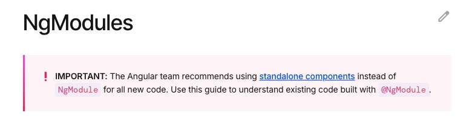

# Changes in "Modern Angular" (WIP)

I've developed several applications using Angular since its early versions. I started working with Angular using version 1.2 and I suffered the revolution of Angular v2. Over time, I continued using Angular, progressing to version 14.

Currently, in this project, I am using Angular version 19. While the core principles remain the same, I have noticed some important changes. Let’s explore them.


## Standalone Components vs Modules

Traditionally, Angular applications were built around NgModules. Since Angular 15, a new concept called "Standalone Components" has been introduced. This approach makes a lot of sense, particularly for a microfrontend-style architecture.

According to [Angular's official documentation](https://angular.dev/guide/ngmodules/overview), it is now recommended to use standalone components instead of modules.




**It's important to note that NgModules still exist and they are not deprecated and there are still many libraries using NgModules, so Standalone Components and NgModules are compatible.** For instance, [Ng-Bootstrap](https://ng-bootstrap.github.io/#/getting-started) offers both ways to use its components.


In my opinion, while NgModules can be complex and hard to manage dependencies without good governance and methodology, they remain a valuable way to organize functionality when used correctly. That said, moving forward with standalone components seems like the right choice.


#### Creating a Standalone Component

When creating a standalone component, the main difference is that we have to explicitly declare it using "standalone: true":

```typescript
@Component({
  selector: 'app-home',
  standalone: true,
  imports: [],
  templateUrl: './home.component.html',
  styleUrl: './home.component.scss'
})
```


As we said before, NgModules and Standalone components can live together. For instance, it's possible to import an NgModule in a Standalone component using the "**import**" property:

```typescript
@Component({
  selector: 'app-home',
  standalone: true,
  imports: [FormsModule, NgIf],
  templateUrl: './home.component.html',
  styleUrl: './home.component.scss'
})
```

