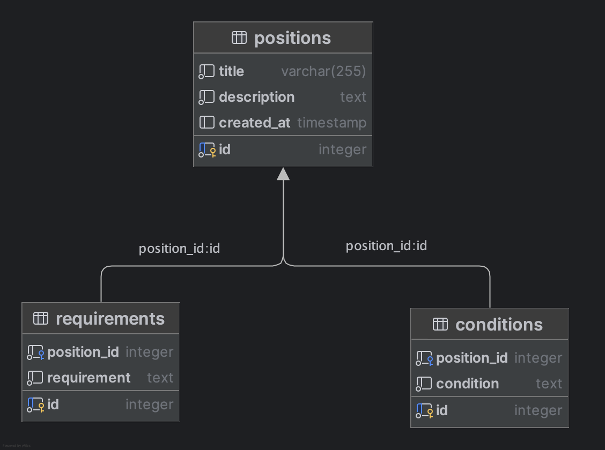

# Hibernate - Eager/Lazy loading

In this section I would like to highlight a common problem when using an ORM instead of raw SQL. 

When working with objects, such as parent and child entities, there are cases where we may only want to retrieve data from the parent without including the associated children.

For instance, in the positions project, when querying for all open positions, we might only want to retrieve the main data, such as the title and description. We don't need to query for conditions or requirements because the final user will only click on those positions whose titles are attractive.


## How it works

We have to choose between two options related to load data from database:

- **Lazy loading**: associated entities or collections are not loaded from the database until they are accessed.
- **Eager loading**: associated entities or collections are loaded immediately along with the parent entity


Let's see in practice. I'm going to use the "positions service" for candidates. Positions are modeled the following way:




We have two use cases:

- **Get all positions**: in this case, we only want to recover positions data, that means: title and description. We don't want data from requirements or conditions because it's not necessary 
- **Get position detail:** in this case, we do want to recover child entities (requirements and conditions) because the action is on demand (the final user does want to get details about a position)


What happens if we set "eager" policy? 

```
@Entity
@Table(name = "POSITIONS")
public class PositionEntity {
		...
		...
		
    @OneToMany(cascade = CascadeType.ALL, mappedBy = "position", fetch = FetchType.EAGER)
    private List<RequirementEntity> requirements;

    @OneToMany(cascade = CascadeType.ALL, mappedBy = "position", fetch = FetchType.EAGER)
    private List<ConditionEntity> conditions;
    
 		...
 		...
}
```


When we call to "get all positions", the queries executed are:

```shell
2024-11-30T00:25:05.900+01:00  INFO 44295 --- [positions-service] [nio-8080-exec-3] .j.c.c.s.p.a.a.r.PositionsRestController : GET received: getting all positions
2024-11-30T00:25:05.900+01:00  INFO 44295 --- [positions-service] [nio-8080-exec-3] c.j.c.c.s.p.business.PositionService     : Getting all positions
Hibernate: select pe1_0.id,pe1_0.description,pe1_0.title from positions pe1_0
Hibernate: select r1_0.position_id,r1_0.id,r1_0.description from requirements r1_0 where r1_0.position_id=?
Hibernate: select c1_0.position_id,c1_0.id,c1_0.description from conditions c1_0 where c1_0.position_id=?
2024-11-30T00:25:05.968+01:00  INFO 44295 --- [positions-service] [nio-8080-exec-3] .j.c.c.s.p.a.a.r.PositionsRestController : GET response: returning 1 positions
```


We can see three queries:

- query to postions table: "select pe1_0.id,pe1_0.description,pe1_0.title from positions pe1_0"
- query to requirements table: "select r1_0.position_id,r1_0.id,r1_0.description from requirements r1_0 where r1_0.position_id=?" ---> NOT NEEDED
- query to conditions table: "select c1_0.position_id,c1_0.id,c1_0.description from conditions c1_0 where c1_0.position_id=?" ---> NOT NEEDED


Now, imagine that there are a lot of positions...


Ok, let's change to "lazy loading":

```
@Entity
@Table(name = "POSITIONS")
public class PositionEntity {
		...
		...
		
    @OneToMany(cascade = CascadeType.ALL, mappedBy = "position", fetch = FetchType.LAZY)
    private List<RequirementEntity> requirements;

    @OneToMany(cascade = CascadeType.ALL, mappedBy = "position", fetch = FetchType.LAZY)
    private List<ConditionEntity> conditions;
    
 		...
 		...
}
```


When we call to "get all positions", the queries executed are:

```shell
024-11-30T00:32:11.347+01:00  INFO 49822 --- [positions-service] [nio-8080-exec-1] .j.c.c.s.p.a.a.r.PositionsRestController : GET received: getting all positions
2024-11-30T00:32:11.347+01:00  INFO 49822 --- [positions-service] [nio-8080-exec-1] c.j.c.c.s.p.business.PositionService     : Getting all positions
Hibernate: select pe1_0.id,pe1_0.description,pe1_0.title from positions pe1_0
2024-11-30T00:32:11.456+01:00  INFO 49822 --- [positions-service] [nio-8080-exec-1] .j.c.c.s.p.a.a.r.PositionsRestController : GET response: returning 1 positions
```


Perfect! Only a query is executed: *select pe1_0.id,pe1_0.description,pe1_0.title from positions pe1_0*


If we call to "get position detail", logs are:

```
2024-11-30T00:33:41.588+01:00  INFO 49822 --- [positions-service] [nio-8080-exec-4] .j.c.c.s.p.a.a.r.PositionsRestController : GET received: getting position with id 1
2024-11-30T00:33:41.589+01:00  INFO 49822 --- [positions-service] [nio-8080-exec-4] c.j.c.c.s.p.business.PositionService     : Getting position detail for position with id 1
Hibernate: select pe1_0.id,pe1_0.description,pe1_0.title from positions pe1_0 where pe1_0.id=?
Hibernate: select c1_0.position_id,c1_0.id,c1_0.description from conditions c1_0 where c1_0.position_id=?
Hibernate: select r1_0.position_id,r1_0.id,r1_0.description from requirements r1_0 where r1_0.position_id=?
2024-11-30T00:33:41.642+01:00  INFO 49822 --- [positions-service] [nio-8080-exec-4] c.j.c.c.s.p.business.PositionService     : Position with id 1 found
2024-11-30T00:33:41.643+01:00  INFO 49822 --- [positions-service] [nio-8080-exec-4] .j.c.c.s.p.a.a.r.PositionsRestController : Position with id 1 found. Returning 200 status
```


We can see that there are three queries (position, requirements and conditions) and it's correct because when we want to know the detail of a position, we want to know everything, including conditions and requirements.


If we set a lazy loading strategy, queries associated with child entities are performed only when needed, not before: when you request for that data in your code:

```
...

	conditions = positionEntity.getConditions().stream().map(this::conditionsEntityToConditions).toList();
  requirements = positionEntity.getRequirements().stream().map(this::requirementsEntityToRequirements).toList();
  
...
```

